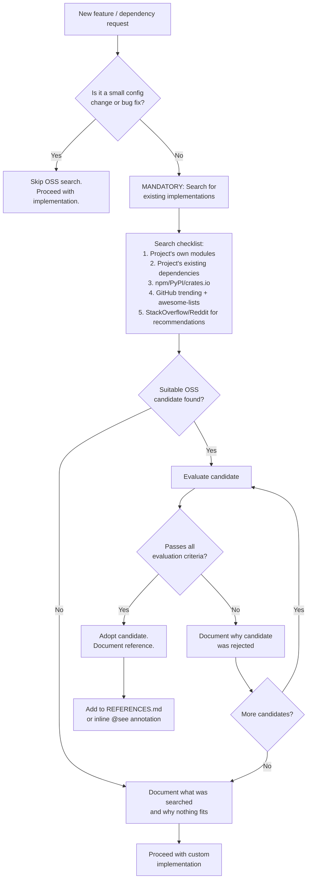

# OSS-First Search Workflow

Before you write new code for a feature, search for existing open source implementations
first. This isn't optional — it's how you avoid reinventing wheels and introducing
maintenance burden you didn't need.

This workflow comes from a hard requirement: "Search and research known open source
projects first." It saves time, reduces bugs, and gives your AI assistant better
context when it can reference a working implementation instead of guessing.

## When this workflow activates

Run this workflow when **any** of the following are true:

- A new feature is requested (larger than a small config change or bug fix)
- A new dependency is being considered
- A new utility module is being created
- Functionality is being added that likely exists in the ecosystem

Skip it for small config changes and straightforward bug fixes.

## Decision tree



**Text summary (for screen readers):** The decision tree starts with a new feature or
dependency request. If it's a small config change or bug fix, skip the search. Otherwise,
the search is mandatory. Search five sources in order: your own modules, existing
dependencies, package registries, GitHub trending/awesome-lists, and community
recommendations. If a candidate is found, evaluate it against the criteria below. If it
passes, adopt it and document the reference. If it fails, document why and check for more
candidates. If no candidates remain, document what was searched and proceed with a custom
implementation.

## Evaluation criteria

For each OSS candidate you find, evaluate it against these six criteria:

| Criterion | Requirement | How to Check |
| --- | --- | --- |
| **License compatibility** | Must be compatible with the adopting project's license | Check `LICENSE` file; use `license-checker` for npm packages |
| **Maintenance status** | Active maintenance (commit in last 6 months) OR stable/complete | Check last commit date, open issue count, bus factor (contributor count) |
| **Bundle size impact** | Must not push the project over its bundle budget | Use `bundlephobia.com` for npm packages; `cargo bloat` for Rust; manual measurement otherwise |
| **Accessibility compliance** | If UI component, must ship accessible markup or be easily made accessible | Check for ARIA attributes, keyboard handling, screen reader testing in the library's docs/tests |
| **Security posture** | No known high/critical vulnerabilities | Run `npm audit` / `pip audit` / `cargo audit` against the candidate |
| **Use case fit** | Solves the actual problem without requiring significant adaptation | Prototype integration; verify it handles edge cases |

## Reference documentation template

When you adopt an OSS project or borrow patterns from one, record it. This record is
the first place to check during debugging sessions — before you start guessing, check
whether the reference project has already solved the problem.

```markdown
## [Feature Name] — OSS Reference

- **Project:** [name] ([URL])
- **Version:** [pinned version]
- **License:** [license identifier]
- **Patterns borrowed:** [specific patterns, algorithms, or approaches adopted]
- **Integration notes:** [how it was integrated, any adaptations made]
- **Debug reference:** When debugging this feature, check the reference project's
  issues/docs first: [URL to issues page]
- **Decision date:** [YYYY-MM-DD]
- **Decision maker:** [who approved the adoption]
```

## Search checklist (copy-paste version)

Use this when you're in the middle of a feature request:

- [ ] Searched project's own modules for existing implementation
- [ ] Checked project's existing dependencies for the capability
- [ ] Searched package registry (npm / PyPI / crates.io / etc.)
- [ ] Checked GitHub trending and relevant awesome-lists
- [ ] Searched StackOverflow/Reddit for community recommendations
- [ ] Documented search results (what was found, what was rejected, why)
