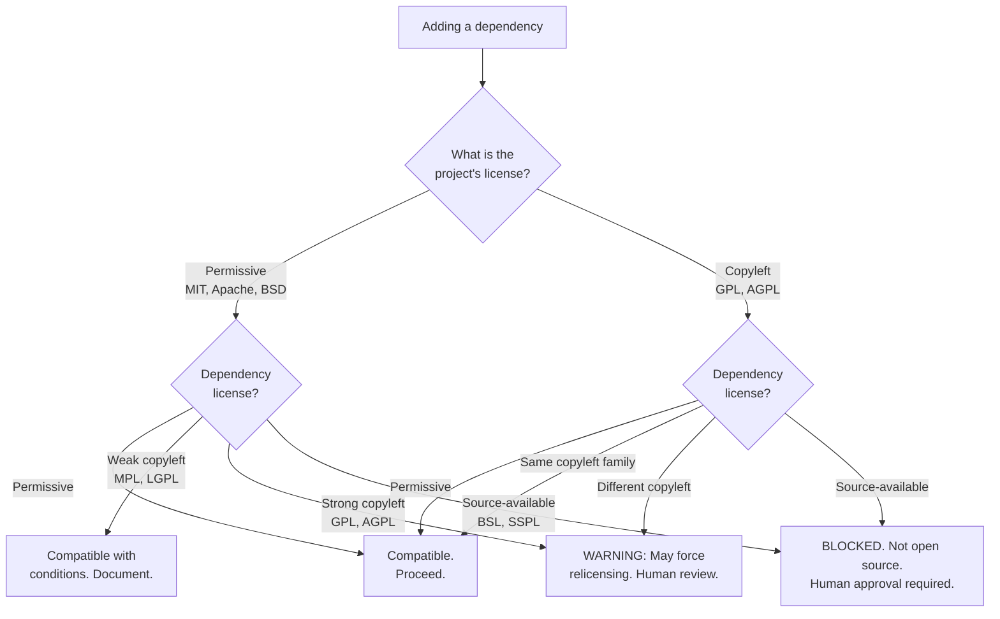

# Legal and License AI Guidance

This guide teaches AI coding tools how to handle licensing, attribution, and legal
requirements for open source AT projects. Licensing mistakes are hard to undo, so
the rules here are strict.

**Source:** Open Source Guides (Section 12), `docs/OPEN_SOURCE_PROJECTS.md` from
the origin project.

## AI agent license rules

AI agents MUST:

1. **Check license compatibility** before suggesting any new dependency
   (Open Source Guides Section 12.5)
2. **Never add a dependency without recording it** in the project's dependency
   documentation (following the pattern in your project's third-party notices)
3. **Classify dependencies** as runtime, dev/toolchain, or referenced/inspirational
4. **Preserve copyright notices** -- never remove LICENSE files, copyright headers,
   or attribution notices from vendored code
5. **Respect copyleft requirements** -- if the project uses GPL, all added dependencies
   must be GPL-compatible
6. **Generate SBOM entries** when adding dependencies (if the project uses SBOM tooling)

AI agents MUST NEVER:

- Remove or modify LICENSE files
- Add dependencies with incompatible licenses without flagging for human review
- Claim AI-generated code is "original" when it may incorporate training data patterns
- Add proprietary or source-available dependencies (BSL, SSPL) to open source projects
  without explicit maintainer approval
- Skip the OSS-first search (see `checklists/oss-first-search.md`) and jump straight
  to implementation

## License compatibility decision tree



**Text summary (for screen readers):** The decision tree starts with the project's
own license. For permissive-licensed projects (MIT, Apache, BSD): permissive
dependencies are compatible; weak copyleft (MPL, LGPL) is compatible with conditions;
strong copyleft (GPL, AGPL) may force relicensing and needs human review;
source-available (BSL, SSPL) is blocked. For copyleft-licensed projects (GPL, AGPL):
permissive and same-family copyleft are compatible; different copyleft families need
human review; source-available is blocked.

## Dependency attribution template

When you add a dependency, record it. This pattern comes from the origin project's
`docs/OPEN_SOURCE_PROJECTS.md`:

```markdown
### [Project Name]

- **Repo**: [URL]
- **License**: [SPDX identifier]
- **Version**: [pinned version]
- **Category**: [Runtime | Dev/Toolchain | Referenced/Inspirational]
- **Usage**: [one sentence: what it does in your project]
- **Added**: [date]
- **Decision**: [why this dependency was chosen over alternatives]
```

### Project-specific configuration

- **Dependency documentation file:** `[CONFIGURE: path, e.g., THIRD_PARTY_NOTICES.md or docs/OPEN_SOURCE_PROJECTS.md]`
- **SBOM tooling:** `[CONFIGURE: e.g., syft, trivy, or "none"]`
- **License checker command:** `[CONFIGURE: e.g., npx license-checker --production]`

## AI-generated code: copyright and attribution

The legal status of AI-generated code is evolving rapidly. As of early 2026, here's
what matters for open source AT projects.

### What AI agents MUST do

- Never claim AI-generated output is "original work" in copyright headers
- Attribute training-data-derived patterns honestly when recognizable (e.g., "adapted
  from [library] documentation examples")
- Follow the project's existing copyright header convention for all new files
- When AI generates code that closely mirrors a specific open source project's patterns,
  add a comment citing the reference project (ties to the OSS-first search documentation
  in `checklists/oss-first-search.md`)

### What AI agents MUST NOT do

- Add copyright claims on behalf of AI tools ("Copyright 2026 AI Assistant")
- Remove existing copyright notices from files being modified
- Claim that AI output is free from all copyright encumbrance -- this is legally uncertain
- Generate license headers that conflict with the project's chosen license

### What maintainers should consider

- The U.S. Copyright Office currently requires "human authorship" for copyright
  registration; purely AI-generated code may not be copyrightable
- AI-assisted code (human-directed, AI-executed) likely retains human copyright
- When in doubt, treat AI output as a tool-assisted creation and attribute the human
  who directed and reviewed it
- Track AI-heavy contributions in commit messages or PR metadata for future legal
  clarity (ties to AI-Assisted Contribution Transparency in
  `docs/OSS_CONTRIBUTION_AI_GUIDE.md`)

### Project-specific configuration

- **Project license:** `[CONFIGURE: SPDX identifier, e.g., GPL-3.0-or-later]`
- **Copyright holder:** `[CONFIGURE: e.g., "Your Name" or "Your Organization"]`
- **AI disclosure policy:** `[CONFIGURE: "required" or "not required" — see OSS_CONTRIBUTION_AI_GUIDE.md]`
