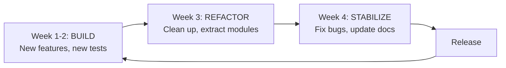

# Process Cadence

This guide defines repeatable development cycles that prevent the "build everything
at once, then crash" pattern.

Without deliberate rhythm, AI-assisted projects fall into boom-and-bust cycles —
intense building followed by forced recovery. The antidote is a repeatable cadence
that alternates between growth and consolidation.

## Build / refactor cycle

A four-week cycle that alternates between building, cleaning up, and stabilizing:

**Text summary (for screen readers):** The cycle has four phases. Weeks 1-2 are for
building (new features and tests). Week 3 is for refactoring (cleanup and module
extraction). Week 4 is for stabilizing (bug fixes, docs updates). Then a release,
and the cycle repeats.

### BUILD phase AI rules (Weeks 1-2)

- Feature flags required for non-trivial features
- Tests written alongside or before implementation
- PR scope limited to one feature or fix
- AI sessions bounded to 2-3 hours max (per METR/Copilot findings on diminishing returns)

### REFACTOR phase AI rules (Week 3)

- No new features -- only restructuring and extraction
- Characterization tests written before refactoring
- AI bloat scan (see `checklists/ai-code-bloat-scan.md`) run on all recent additions
- Dead code removal prioritized

### STABILIZE phase AI rules (Week 4)

- Bug fixes only -- no refactoring that could introduce new bugs
- Documentation updated to match current state
- All quality gates run and passing
- CHANGELOG updated

## AI session boundaries

Per the GitHub Copilot Field Study (arXiv:2510.06000): "Moderate AI use improves
efficiency; excessive or combined-mode use REDUCES benefits."

Guidelines:

- Single focused task per AI session (one bug fix, one feature, one refactor)
- Session length: 30-90 minutes for implementation, 15-30 minutes for research
- Break between sessions to review AI output with fresh eyes
- Never chain 3+ AI sessions without human review of accumulated changes
- Research and analysis tasks must be performed by the primary model in the
  session, not delegated to subagents. Subagents are appropriate for mechanical
  subtasks (file creation, format conversion, command execution) but not for
  reasoning over source material.
- If you cannot use the most capable model for comprehension-critical work,
  reduce scope or stop. Do not down-tier and proceed. A partial result from the
  right model is always safer than a complete result from the wrong one.

### Validation-before-completion rule

A plan phase cannot be marked "completed" until the plan's own validation phase
has been executed. If a plan has a validation phase (e.g., Phase 6), all
preceding phases remain "in progress" until validation passes. Premature
completion marking creates a false signal that enables scope escape.

Research demonstrates that iterative AI refinement without validation gates
actively degrades output quality — a 37.6% increase in critical defects after
five unchecked iterations has been measured in controlled study [R3, Shukla et
al., IEEE-ISTAS 2025]. Validation gates are not optional quality checks; they
are load-bearing structural elements that prevent active degradation.

### No scope escape rule

Work outside the assigned plan is forbidden until the plan's exit criteria are
confirmed. Starting new tasks before plan validation is itself a plan failure,
regardless of whether the new tasks are valuable.

This rule addresses a documented agent failure pattern: false-termination, where
agents prematurely assume task completion and move to new scope [S1, Cuadron et
al., 2025]. The "no scope escape" guardrail is the direct counter.

### Validation fidelity rule

When a plan specifies a validation step by name (e.g., "run checklist X"),
execute that specific checklist. A different check that seems equivalent (e.g.,
checking file sizes instead of running the named bloat scan) does not satisfy
the requirement.

Substituting a different validation method is itself a form of skipping
validation. The named checklist was chosen for a reason — it tests specific
conditions that a substitute may not cover.

### Narrowing and widening rhythm

The recurring problem in AI-assisted projects is always widening (adding
features, adding tools, adding scope) without narrowing (testing, refactoring,
removing). The development rhythm should alternate:

> Narrow it down. Then widen it. Then narrow it down. Then widen it.

AI should be used in the narrowing phases — writing tests, running accessibility
scans, identifying dead code, removing unnecessary abstractions. AI in the
widening phases (generating features, adding dependencies, building new modules)
creates complexity that the narrowing phases must then clean up.

Map the BUILD / REFACTOR / STABILIZE cycle to this rhythm:

- **BUILD** = widening (human-led design, AI-assisted implementation)
- **REFACTOR** = narrowing (AI-assisted test writing, dead code removal, bloat scanning)
- **STABILIZE** = narrowing (bug fixes, documentation, validation)

### AI-for-safeguards hierarchy

When using AI agents for quality infrastructure, follow this priority order:

1. HTML validation — catch structural problems first
2. Accessibility testing — catch conformance violations
3. End-to-end testing — catch behavioral regressions
4. Linting and static analysis — catch code style issues
5. Only then: AI-generated feature code, constrained by all above checks

The agents that fix code must be constrained by the agents that test code.
Feature code generated without functioning test infrastructure introduces
undetectable regressions — existing regression tests catch only 7.6% of
semantics-changing code changes [R7, ChangeGuard, FSE 2025].

### Structured logging as AI behavior audit

When AI generates code that interfaces with external systems (scrapers, APIs,
data pipelines), structured logging is a mandatory quality gate — not optional
infrastructure. Machine-parseable logs make AI-generated code behavior
observable and auditable.

Structured logging serves double duty in AI-assisted projects: debugging and
auditing AI-generated code behavior in production. If AI writes a scraper and it
starts pulling in garbage data, structured logs tell you exactly where it went
wrong.

When adding structured logging to AI-generated code:

- Use a structured logging library (e.g., `[CONFIGURE: e.g., structlog for Python, pino for Node]`)
- Log at the boundaries: inputs received, outputs produced, external calls made
- Include correlation IDs for tracing across services
- Log failures with full context, not just error messages

## Bootstrapping the test phase

Projects that start with zero or near-zero test coverage face a chicken-and-egg
problem: you need tests to refactor safely, but you need to understand the code
to write good tests. AI test generation tools can break this deadlock — not by
replacing human-authored tests, but by creating a baseline that makes the first
refactoring pass possible.

### Four-step bootstrap path

1. **Generate characterization tests for zero-coverage files.** Use an AI test
   generation tool to produce tests that document current behavior — not ideal
   behavior. These tests exist to detect regressions, not to validate correctness.
   Research-validated tools report pass rates around 80-84% and per-file costs
   around $0.63 [R8, TestForge; R9, CoverUp].
   Tool: `[CONFIGURE: e.g., TestForge for JS/TS, CoverUp for Python, or project-specific choice]`

2. **Deploy PR-level regression detection.** Add a CI step that runs the
   characterization tests on every PR. Low-cost regression detection (~$0.003/PR)
   catches behavioral changes before they merge [R10, Testora].
   Tool: `[CONFIGURE: e.g., Testora, or project-specific regression detection]`

3. **Use the new tests to enable safe refactoring.** With characterization tests
   in place, the REFACTOR phase of the build/refactor/stabilize cycle has a safety
   net. Refactoring that breaks a characterization test reveals a behavioral
   change that needs human review — even if the original behavior was accidental.

4. **Map environment tool tasks to cycle phases.** Add test-generation and
   regression-detection tasks to the environment tool config so they run as part
   of the standard workflow, not as one-off commands.

### Constraints

- Characterization tests generated by AI are not a substitute for human-authored
  specification tests. They document what the code *does*, not what it *should do*.
- AI-generated tests of AI-generated code are not a sufficient quality gate (see
  the test-first rule in the agent rule files). The bootstrap path is an exception
  for the specific case of creating initial coverage from zero — not a general
  license to skip human test authorship.
- Review AI-generated tests before trusting them as regression baselines. A test
  that asserts on a bug locks in the bug.

## Adapting the cadence

The four-week cycle is a starting point. Adapt it to your project's rhythm:

| Project Size | Suggested Cadence | Build | Refactor | Stabilize |
| --- | --- | --- | --- | --- |
| Solo / small | 2 weeks | Week 1 | 2 days | 3 days |
| Team / medium | 4 weeks | Weeks 1-2 | Week 3 | Week 4 |
| Large / multi-team | 6 weeks | Weeks 1-3 | Week 4-5 | Week 6 |

The ratio matters more than the absolute duration. Roughly: 50% build, 25% refactor,
25% stabilize.

## Rule enforcement matrix

Written rules alone achieve roughly 30% compliance from AI agents on difficult
domains [S13, SOPBench]. For each blocking rule in the golden rules, identify or
create an automated enforcement mechanism that catches violations before they
reach review.

| Rule | Enforcement Mechanism | Type |
| --- | --- | --- |
| Protected files untouched | `[CONFIGURE: pre-commit hook or CI check]` | Automated |
| `:focus-visible` ring on interactive UI | `[CONFIGURE: axe-core rule or custom lint]` | Automated + manual |
| Design tokens for all visual values | `[CONFIGURE: stylelint rule or grep check]` | Automated |
| `prefers-reduced-motion` respected | `[CONFIGURE: axe-core or manual test]` | Manual |
| Semantic HTML before ARIA | `[CONFIGURE: axe-core ARIA rules]` | Automated + manual |
| OSS-first search completed | PR template checkbox | Manual review |
| One feature or fix per PR | `[CONFIGURE: PR size check or manual review]` | Manual |
| No comprehension-critical delegation | PR template checkbox + audit | Manual review |
| Scope containment (one function/component) | `[CONFIGURE: diff size check]` | Automated + manual |
| Environment tool used | `[CONFIGURE: CI check for non-env-tool commands]` | Automated |
| AI usage disclosed in PR | PR template checkbox | Manual review |
| Tests exist before AI implementation | `[CONFIGURE: test coverage gate]` | Automated |
| Gold standard exists for pattern | PR template checkbox | Manual review |

Add automated enforcement for every rule where a pre-commit hook, CI check, or
linting rule can catch violations. Manual-only enforcement is acceptable as a
starting point but should be automated over time.

## Core developer review load protection

AI adoption causes a measurable shift in review burden: experienced developers
face a 19% drop in original code productivity and review 6.5% more code after AI
adoption [S12, 2025]. Without explicit load management, the team members best
positioned to maintain quality are the ones most burdened by AI-generated code
review.

When AI-generated PRs are submitted, limit the volume of AI-generated PRs in a
single review cycle. Core developers should not review more than
`[CONFIGURE: max_ai_prs_per_cycle, e.g., 3]` AI-generated PRs per sprint
without team agreement. AI-generated PRs do not reduce the review time allocated
to human-authored PRs.

### Project-specific configuration

- **Cycle length:** `[CONFIGURE: e.g., 4 weeks]`
- **Release cadence:** `[CONFIGURE: e.g., end of each cycle, monthly, quarterly]`
- **AI session max length:** `[CONFIGURE: e.g., 90 minutes]`
- **Max chained sessions before human review:** `[CONFIGURE: e.g., 2]`
- **Max AI PRs per review cycle:** `[CONFIGURE: e.g., 3 per sprint]`
- **Structured logging library:** `[CONFIGURE: e.g., structlog for Python, pino for Node]`
