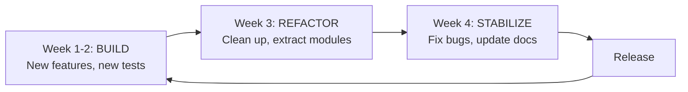

# Process Cadence

This guide defines repeatable development cycles that prevent the "build everything
at once, then crash" pattern.

From team discussion: "We have weird cycles of excess and weird cycles of recovery,
and those are the overarching schedules that we seem to be on." And: "Build, build,
build, refactor, refactor, refactor. These things are more about processes. We can't
always be growing."

## Build / refactor cycle

A four-week cycle that alternates between building, cleaning up, and stabilizing:

**Text summary (for screen readers):** The cycle has four phases. Weeks 1-2 are for
building (new features and tests). Week 3 is for refactoring (cleanup and module
extraction). Week 4 is for stabilizing (bug fixes, docs updates). Then a release,
and the cycle repeats.

### BUILD phase AI rules (Weeks 1-2)

- Feature flags required for non-trivial features
- Tests written alongside or before implementation
- PR scope limited to one feature or fix
- AI sessions bounded to 2-3 hours max (per METR/Copilot findings on diminishing returns)

### REFACTOR phase AI rules (Week 3)

- No new features -- only restructuring and extraction
- Characterization tests written before refactoring
- AI bloat scan (see `checklists/ai-code-bloat-scan.md`) run on all recent additions
- Dead code removal prioritized

### STABILIZE phase AI rules (Week 4)

- Bug fixes only -- no refactoring that could introduce new bugs
- Documentation updated to match current state
- All quality gates run and passing
- CHANGELOG updated

## AI session boundaries

Per the GitHub Copilot Field Study (arXiv:2510.06000): "Moderate AI use improves
efficiency; excessive or combined-mode use REDUCES benefits."

Guidelines:

- Single focused task per AI session (one bug fix, one feature, one refactor)
- Session length: 30-90 minutes for implementation, 15-30 minutes for research
- Break between sessions to review AI output with fresh eyes
- Never chain 3+ AI sessions without human review of accumulated changes

## Adapting the cadence

The four-week cycle is a starting point. Adapt it to your project's rhythm:

| Project Size | Suggested Cadence | Build | Refactor | Stabilize |
| --- | --- | --- | --- | --- |
| Solo / small | 2 weeks | Week 1 | 2 days | 3 days |
| Team / medium | 4 weeks | Weeks 1-2 | Week 3 | Week 4 |
| Large / multi-team | 6 weeks | Weeks 1-3 | Week 4-5 | Week 6 |

The ratio matters more than the absolute duration. Roughly: 50% build, 25% refactor,
25% stabilize.

### Project-specific configuration

- **Cycle length:** `[CONFIGURE: e.g., 4 weeks]`
- **Release cadence:** `[CONFIGURE: e.g., end of each cycle, monthly, quarterly]`
- **AI session max length:** `[CONFIGURE: e.g., 90 minutes]`
- **Max chained sessions before human review:** `[CONFIGURE: e.g., 2]`
