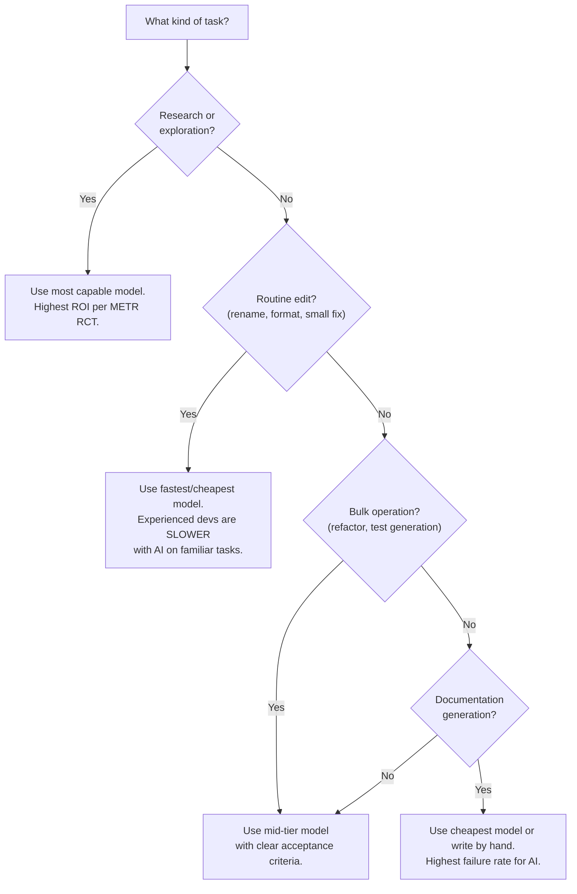

# Token Economics and Cost Awareness

AI-assisted development has hidden costs — context window bloat, preference overhead,
and diminishing returns. This guide helps you see and control them.

From team discussion: "Do those baseline preferences bloat your tokens every time you
send them?" "Oh my God. So they just slowly raise the cost of things invisibly almost."

## Token-efficient rule design

Rules files are injected into every AI prompt. Every word costs tokens. Design rules to
be DENSE, not VERBOSE.

**Good (dense):**

```
NEVER modify public/wasm/. NEVER use git commit -m. ALL UI must have :focus-visible.
Use design tokens from variables.css. Animations must respect prefers-reduced-motion.
```

**Bad (verbose):**

```
It is very important to note that you should never modify any files located in the
public/wasm/ directory. This is because these files contain official binary assets that
are downloaded via setup scripts and any modification could cause catastrophic breakage...
```

### Guidelines

- Rules files should be under 2,000 tokens total
- Use imperative mood ("NEVER modify" not "You should avoid modifying")
- One rule per line where possible
- Group related rules under short headers
- Prefer `pixi.toml` task descriptions as context (dense, structured, machine-readable)
  over free-text explanations

From team discussion: "It's one file and it contains the environments and it contains
the tasks that the environments are run in with text descriptions about what the tasks
do and what the task arguments are. And it also has the input and the output files."

## Model tier selection as cost control

From team discussion: "I used Opus this week and then it was just shitting text and then
eventually it was just farts because there's no money left."

AI model selection directly affects budget sustainability. Here's when to use which tier:



**Text summary (for screen readers):** Use your most capable (expensive) model for
research and exploration -- that's where AI gives the best return. Use the cheapest
model for routine edits, because experienced devs are actually slower with AI on
familiar tasks. Use mid-tier for bulk operations like refactoring. Never burn premium
credits on documentation generation -- it has the highest failure rate.

### Budget rule of thumb

Set a monthly AI credit cap and treat it like a cloud budget. When credits run low,
switch to hands-on coding for the remainder of the cycle -- this is often MORE
productive for familiar codebases anyway.

## Cursor preferences audit

Cursor preferences grow with every update. Periodically audit:

- `.cursor/rules/` -- remove rules that duplicate what's in `AGENTS.md`
- Cursor settings -- disable auto-features that inject hidden context
- Session history -- clear old sessions that may be injected as context

## Goodhart's Law warning

From team discussion: "We have crossed a Rubicon in Goodhart's law where the features
become a metric and it ceased to be a feature anymore."

**Anti-pattern:** Measuring AI productivity by features shipped, lines of code generated,
or PRs created. These metrics incentivize bloat, not quality.

**Better metrics:**

- Tests passing (binary -- they pass or they don't)
- Accessibility audit score (Lighthouse, axe-core)
- Bundle size delta (did the change make the build bigger or smaller?)
- User-reported issues resolved (not just closed)
- Time from bug report to verified fix

These measure outcomes, not output. An AI session that deletes 200 lines and fixes a
real accessibility bug is worth more than one that generates 2,000 lines of new code.

### Project-specific configuration

- **Monthly AI credit cap:** `[CONFIGURE: e.g., $50/month, 1M tokens/month]`
- **Preferred model tiers:** `[CONFIGURE: e.g., Claude Opus for research, Claude Haiku for routine edits]`
- **Audit frequency:** `[CONFIGURE: e.g., monthly Cursor preferences review]`
