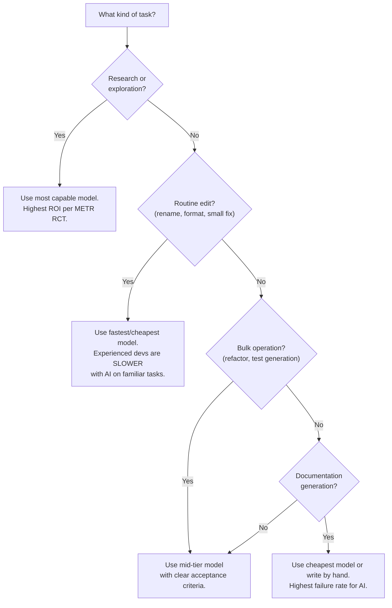

# Token Economics and Cost Awareness

AI-assisted development has hidden costs — context window bloat, preference overhead,
and diminishing returns. This guide helps you see and control them.

Baseline preferences and system prompts are injected into every request, raising
token costs invisibly with each interaction.

## Token-efficient rule design

Rules files are injected into every AI prompt. Every word costs tokens. Design rules to
be DENSE, not VERBOSE.

**Good (dense):**

```
NEVER modify public/wasm/. NEVER use git commit -m. ALL UI must have :focus-visible.
Use design tokens from variables.css. Animations must respect prefers-reduced-motion.
```

**Bad (verbose):**

```
It is very important to note that you should never modify any files located in the
public/wasm/ directory. This is because these files contain official binary assets that
are downloaded via setup scripts and any modification could cause catastrophic breakage...
```

### Guidelines

- Rules files should be under 2,000 tokens total
- Use imperative mood ("NEVER modify" not "You should avoid modifying")
- One rule per line where possible
- Group related rules under short headers
- Prefer `pixi.toml` task descriptions as context (dense, structured, machine-readable)
  over free-text explanations

Environment tool config files pack environments, task definitions, descriptions,
arguments, and input/output declarations into a single machine-readable file —
far denser than free-text rule documents.

## Model tier selection as cost control

Burning through a monthly AI budget in a single week of heavy usage is a common
early mistake — and the quality of output degrades long before the credits run out.

AI model selection directly affects budget sustainability. Here's when to use which tier:



**Text summary (for screen readers):** Use your most capable (expensive) model for
research and exploration -- that's where AI gives the best return. Use the cheapest
model for routine edits, because experienced devs are actually slower with AI on
familiar tasks. Use mid-tier for bulk operations like refactoring. Never burn premium
credits on documentation generation -- it has the highest failure rate.

### Delegation cost traps

The model-tier flowchart above applies to the model **actually doing the
reasoning**, not just the orchestrating model. An orchestrator that delegates
research reading to a cheaper subagent has violated the flowchart even though
the orchestrator itself is the most capable model.

Delegating research reading to subagents is a false economy. The tokens saved
on the reading step are dwarfed by the cost of acting on inaccurate summaries.

**Rule:** If a task appears in the "Use most capable model" path of the
selection flowchart, it MUST NOT be delegated to a cheaper model via subagents,
task tools, or any other delegation mechanism.

**Classification carve-out for documentation:** The flowchart routes
"Documentation generation?" toward cheaper models. That guidance applies to
*mechanical* documentation: reformatting existing content, generating
boilerplate, updating CHANGELOGs from explicit commit lists. Documentation
that **encodes new project understanding** -- requirements extracted from
meetings, specifications derived from research, transcript-derived summaries --
is comprehension-critical and must follow the "Research or exploration?" path,
not the "Documentation generation?" path.

See [AI_TASK_DELEGATION_RULES.md](AI_TASK_DELEGATION_RULES.md) for the full
delegation policy.

### Budget rule of thumb

Set a monthly AI credit cap and treat it like a cloud budget. When credits run low,
switch to hands-on coding for the remainder of the cycle -- this is often MORE
productive for familiar codebases anyway.

## Cursor preferences audit

Cursor preferences grow with every update and may inflate token usage
invisibly. Long system prompts create substantial computational bottlenecks
due to costly memory access patterns — each request redundantly processes
the system prompt [S17, RelayAttention, 2024]. Research demonstrates that
20% prompt reduction is achievable with marginal performance loss on most
tasks.

Periodically audit:

- `.cursor/rules/` — remove rules that duplicate what's in `AGENTS.md`
- Cursor settings — disable auto-features that inject hidden context
- Session history — clear old sessions that may be injected as context
- Review what Cursor sends with each prompt (check the sent context)
- Minimize rules to reduce per-prompt token overhead
- Prefer dense, high-information rule formats (environment tool config files)
  over verbose natural language rules
- Check for invisible defaults: auto-authoring attribution (commits attributed
  to the AI tool instead of the developer), auto-context injection, and
  auto-indexing — each consumes tokens or changes behavior without explicit
  opt-in
- Consider alternatives to your current AI coding tool if costs are
  unsustainable — tool lock-in increases when rules are stored in
  tool-specific formats (the playbook ships in 4 formats to prevent this)

## Goodhart's Law warning

When feature count becomes the measure of progress, features stop being
improvements and start being metric-padding.

**Anti-pattern:** Measuring AI productivity by features shipped, lines of code generated,
or PRs created. These metrics incentivize bloat, not quality.

**Better metrics:**

- Tests passing (binary -- they pass or they don't)
- Accessibility audit score (Lighthouse, axe-core)
- Bundle size delta (did the change make the build bigger or smaller?)
- User-reported issues resolved (not just closed)
- Time from bug report to verified fix

These measure outcomes, not output. An AI session that deletes 200 lines and fixes a
real accessibility bug is worth more than one that generates 2,000 lines of new code.

### Project-specific configuration

- **Monthly AI credit cap:** `[CONFIGURE: e.g., $50/month, 1M tokens/month]`
- **Preferred model tiers:** `[CONFIGURE: e.g., Claude Opus for research, Claude Haiku for routine edits]`
- **Audit frequency:** `[CONFIGURE: e.g., monthly Cursor preferences review]`
