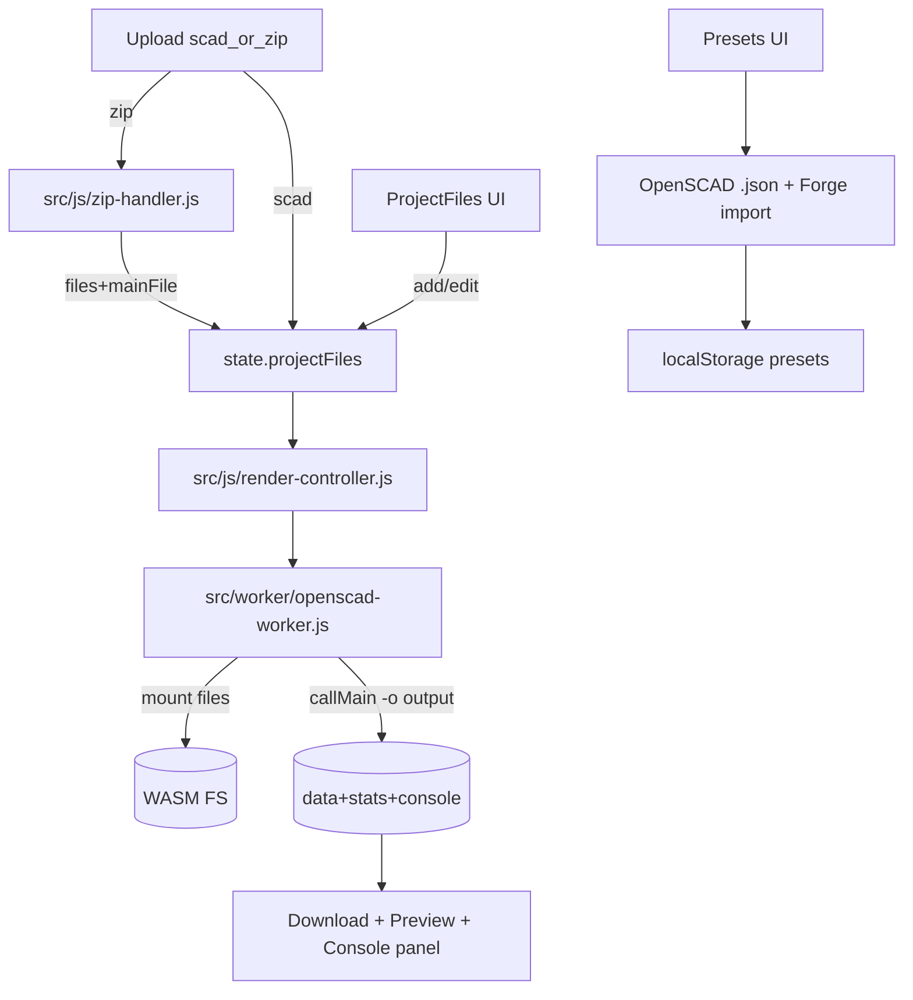

## What the transcript + Ken's files imply

- **Volkswitch keyguard is multi-file by design**:
  - The main model `include`s `openings_and_additions.txt` (`include <openings_and_additions.txt>` in `keyguard_v74.scad`).
  - It can `import()` a screenshot SVG file (`screenshot_file = "default.svg";` and `import(file=screenshot_file, ...)`).
- **Ken relies on OpenSCAD's *native* preset system**:
  - OpenSCAD writes a `.json` file next to the `.scad` and stores multiple "parameter sets" in one file (Wikibooks format: `parameterSets` + `fileFormatVersion`).
  - Ken wants import/export of those presets, and tools to merge many preset files.
- **OpenSCAD-native export needs**:
  - Ken uses "first layer for SVG/DXF file" and expects SVG/DXF export.
  - Ken uses `echo()` for guidance/settings; he wants a visible console.
- **Deep-linking**:
  - Ken wants a URL that opens Assistive Forge with the keyguard already loaded (similar to how MakerWorld links work).


## Current Forge capabilities (relevant)

- **ZIP projects already exist**:
  - `src/js/zip-handler.js` extracts and picks a main `.scad`.
  - `src/worker/openscad-worker.js` mounts `files` into the WASM FS and can render with `mainFile`.
  - `src/main.js` wires `.zip` upload into `handleFile()` and passes `projectFiles`/`mainFilePath` through to rendering.
- **Presets currently use a Forge-specific JSON format**:
  - `src/js/preset-manager.js` expects `type: "openscad-preset"` or `"openscad-presets-collection"`, which is why Ken's OpenSCAD `.json` fails.
- **Exports are currently 3D-only**:
  - `src/js/download.js`/`index.html` only offer `stl,obj,off,amf,3mf`.
- **Console output is captured but not surfaced**:
  - Worker accumulates `openscadConsoleOutput` and includes it in error details, but there is no dedicated UI pane for it.

<!-- ✅ VALIDATION: CURRENT CAPABILITIES - ALL CONFIRMED via code review

ZIP: zip-handler.js lines 24-58 extract as TEXT only (binary limitation noted)

PRESETS: preset-manager.js lines 238-248 only accept Forge format, not OpenSCAD native

EXPORT: download.js lines 9-40 only has stl/obj/off/amf/3mf - no svg/dxf

CONSOLE: openscad-worker.js line 39 accumulates output but lines 1736-1740 only

return it on errors - must modify to return on SUCCESS too

-->

## Target behaviors (definition of "fully compatible")

### A) File/project handling

- Support **3 workflows**:
  - **ZIP project** containing `keyguard_v74.scad` + `openings_and_additions.txt` (+ optionally `default.svg`).
  - **Single .scad + companion file uploads** (user uploads `.scad`, then adds `openings_and_additions.txt` and/or `default.svg`).
  - **Built-in Volkswitch example** (hosted under `public/examples/`) loadable from UI *and via URL parameter*.
- Provide a **simple "Project Files" manager**:
  - Show required/expected companion files when the model references them (detect `include <openings_and_additions.txt>` and `screenshot_file` patterns).
  - Allow adding/replacing files without re-uploading the whole zip.
  - Allow editing `openings_and_additions.txt` in-app (textarea + "Apply & Preview"), with the file stored in `state.projectFiles` and re-mounted on render.

### B) OpenSCAD-native presets support

- Add import/export for **OpenSCAD Customizer `.json` preset files** (Wikibooks format):
  - `{"parameterSets": {"PresetName": {"param":"value", ...}}, "fileFormatVersion":"1"}`
- Add **merge tools**:
  - Import multiple `.json` files at once.
  - Merge into a single file (dedupe by preset name with clear rules: keep existing, overwrite, or rename-on-collision).
- Maintain **Forge presets** too (backward compatibility):
  - Detect format and route to the right importer.

### C) Export SVG/DXF

- Add `svg` and `dxf` output formats end-to-end:
  - UI select (`index.html`), format metadata (`src/js/download.js`), and worker export path (`openscad-worker.js` already supports arbitrary `format` via `-o /tmp/output.${format}`).
  - Provide guidance for Volkswitch users (when output is svg/dxf, remind them to set `generate` to "first layer for SVG/DXF file").

### D) Console output UI

- Add a dedicated **Console panel/modal**:
  - Shows last OpenSCAD output (including `ECHO:` lines Ken uses for instructions).
  - Buttons: Copy, Clear, and "Include in bug report".

### E) Deep-linking / website integration

- Add a query-param loader:
  - `?example=volksswitch-keyguard-v74` → auto-load the built-in example.
  - Optionally (phase 2): `?url=<https://.../project.zip>` for remotely hosted zips (CORS permitting).

## Architecture sketch



## Files likely to change

- Project files UX + deep-link:
  - `src/main.js`
  - `index.html`
  - `src/styles/components.css` (or related CSS) for the new UI block
- OpenSCAD preset import/export + merge:
  - `src/js/preset-manager.js` (add OpenSCAD-native parsing + new export flavor)
  - `src/js/validation-schemas.js` (add schema for OpenSCAD preset JSON, optional)
- SVG/DXF export:
  - `src/js/download.js` (add `svg`, `dxf`)
  - `index.html` (add options)
- Console view:
  - `src/worker/openscad-worker.js` (send console output on success, not just errors)
  - `src/main.js` (UI modal/panel + wiring)

## Implementation notes / constraints

- Keep everything **free/open-source**:
  - Volkswitch keyguard `.scad` headers indicate CC0 dedication.
  - Use existing `jszip` already present.
- Be careful with **binary files in zips**:
  - Current `extractZipFiles()` reads everything as text; that's fine for `.scad/.txt/.svg/.json`, but not for PNG/JPG. We can scope initial support to text assets and clearly message this in the UI.
- Preset type coercion:
  - OpenSCAD `.json` stores values as strings; Forge has a parameter schema (`extractParameters`) that can be used to coerce numbers/booleans/arrays.

## Test strategy (non-invasive)

- Unit tests:
  - Add tests for OpenSCAD preset `.json` parsing + merging behavior.
  - Add tests for svg/dxf format registration.
- E2E tests:
  - Add a zip fixture with `openings_and_additions.txt` and a minimal `default.svg` plus a `.scad` that imports it.

---

## VALIDATION SUMMARY - 2026-01-30

**Research Materials Reviewed:**

- Meeting transcript (2026-01-30 Ken/Brennen discussion - 733 lines)
- keyguard_v74.scad (7022+ lines, CC0 licensed)
- keyguard_v73.scad (comparison for version changes)
- openings_and_additions.txt (template file with variable documentation)
- Volkswitch Research links document

**Codebase Files Verified:**

- `src/js/preset-manager.js` - Import/export format confirmed
- `src/js/zip-handler.js` - Text-only extraction confirmed
- `src/js/download.js` - 3D-only formats confirmed
- `src/worker/openscad-worker.js` - Console output handling verified
- `src/main.js` - URL param and projectFiles handling verified

### ✅ CONFIRMED ACCURATE (No Changes Needed)

1. **Multi-file design** - `include <openings_and_additions.txt>` at line 1768, `screenshot_file = "default.svg"` at line 753
2. **Preset format incompatibility** - Ken's JSON uses `parameterSets` key, Forge expects `type: "openscad-preset"`
3. **SVG/DXF export need** - Line 491 shows "first layer for SVG/DXF file" option exists in keyguard
4. **Console output capture** - Line 39 `openscadConsoleOutput` exists, only returned on errors
5. **ZIP extraction capability** - Full multi-file support already in place
6. **Architecture diagram** - Accurately represents current data flow

### ⚠️ CORRECTIONS / CLARIFICATIONS

1. **Preset JSON structure** - OpenSCAD native format also includes hardcoded tablet/device data

that Ken echoes for debugging (transcript lines 599-620). The "Export Customizer settings"

feature echoes variable values to console, not just the parameterSets structure.

2. **Binary file handling** - Plan correctly notes text-only extraction, but `default.svg` files

are typically text XML. However, SVG CAN contain embedded binary (base64 images). Consider

detecting SVG MIME type and handling appropriately.

3. **Deep-linking scope** - Ken specifically mentioned wanting hyperlinks from volksswitch.org

(transcript line 661-668). The `?example=` param is good, but also consider:
  - Existing `getShareableURL()` in main.js for parameter sharing
  - Ken mentioned "share link" feature at transcript line 682-685

### 🆕 ADDITIONAL FEATURES FROM TRANSCRIPT (Not in Original Plan)

1. **openings_and_additions.txt Editor Features** (transcript lines 415-429):
  - Hot-reload behavior: Ken values instant preview when editing the include file
  - Textarea approach can replicate this with "Apply" button
  - Consider: syntax highlighting for vector format, validation

2. **Customizer Settings Export** (transcript lines 304-314):
  - Ken uses `echo()` to dump all non-default parameter values
  - This is separate from preset JSON - it's for troubleshooting
  - Console panel should make this easily copy-able

3. **Version Compatibility** (transcript lines 520-541):
  - Ken has Python code to upgrade preset JSONs between versions
  - Ken mentions he does 4-6 releases/year
  - Consider: version detection and migration guidance

4. **MakerWorld Limitations Ken Wants to Escape** (throughout transcript):
  - Only 5 presets allowed, deleted on version update
  - No console access at all
  - Dark UI with no accessibility features
  - Can't upload companion files (openings_and_additions.txt)
  - No SVG/DXF export (only STL/OBJ/3MF)

### 📋 RECOMMENDED IMPLEMENTATION PRIORITY

Based on Ken's emphasis in the transcript:

1. **HIGH: OpenSCAD preset import** - Ken explicitly tried this and it failed (line 549)
2. **HIGH: Console output panel** - Ken uses echo() extensively for user guidance
3. **MEDIUM: SVG/DXF export** - Important for laser cutting workflow
4. **MEDIUM: Project files manager** - Needed for openings_and_additions.txt editing
5. **LOW: Deep-linking** - Nice-to-have for Ken's website integration

### 📚 OPEN SOURCE RESOURCES IDENTIFIED

1. **OpenSCAD Customizer JSON format**: Wikibooks standard, well-documented
2. **jszip**: Already in project for ZIP handling
3. **keyguard_v74.scad**: CC0 dedicated, can be used as test fixture
4. **OpenSCAD WASM**: Already using dev version with Manifold support

### 🔧 SPECIFIC CODE CHANGES NEEDED

1. **preset-manager.js** (lines 225-283):
  - Add detection for `parameterSets` key to route to OpenSCAD importer
  - Add new `importOpenSCADPreset()` method
  - Add `exportToOpenSCADFormat()` for reverse conversion

2. **download.js** (lines 9-40):
  - Add `svg` and `dxf` to OUTPUT_FORMATS object
  - MIME types: `image/svg+xml` and `application/dxf`

3. **openscad-worker.js** (around line 1740):
  - Modify success response to include `consoleOutput: openscadConsoleOutput`
  - Clear `openscadConsoleOutput` at start of each render (already done at line 1219)

4. **main.js** (URL param handling around line 3794):
  - Add `?example=` query param detection
  - Load from `public/examples/volkswitch-keyguard-v74/` directory

---

*Validation completed by secondary AI review - original plan content preserved above*

<!-- ANNOTATIONS - 2026-01-30 (assistant validation + junior implementation guide).

Do not delete. These notes validate and expand the plan without removing content. -->

## Validation additions (assistant review)

CONFIRMED from research files in the provided folder:

- `openings_and_additions.txt` explicitly tells users to "look at the Console pane in OpenSCAD" and relies on `echo()` output for guidance. This reinforces the Console panel requirement and should be treated as core functionality, not just a debugging aid.
- The Volkswitch website instructions emphasize the standard OpenSCAD workflow: `.scad` + `openings_and_additions.txt` in the same folder, and a `.json` presets file that shares the base name with the `.scad` (and should be renamed when the `.scad` version changes). This implies the Forge import path should not ignore adjacent OpenSCAD preset `.json` files.
- Transcript confirms: invalid preset import error ("invalid preset file format"), the need for a link that opens the designer directly, and reliance on SVG screenshots imported by OpenSCAD.

CORRECTIONS / CLARIFICATIONS to original plan:

- SVG/DXF export in `keyguard_v74.scad` is gated by keyguard type. It contains a warning string indicating "first layer for SVG/DXF file" is not supported for **3D-Printed** keyguards. The UI should surface this as guidance when SVG/DXF is selected so users do not assume all types are valid.
- The keyguard supports **arbitrary graphics referenced in `openings_and_additions.txt`**, not just `default.svg`. The Project Files manager should allow adding multiple auxiliary assets (SVG/DXF/etc.) beyond the default screenshot file.
- Preset workflow parity: OpenSCAD auto-loads a `.json` with the same base name as the `.scad`. For parity, Forge should either auto-import that file when present in a ZIP, or prompt the user to import it.


## Junior dev implementation guide (expanded, step-by-step)

This section expands each TODO into actionable steps, acceptance criteria, and references.

Use the existing codebase patterns; do not add new dependencies unless necessary.


### TODO: research-volksswitch-requirements (expanded)


**Step 1: Analyze Ken's keyguard_v74.scad file structure**

1. Read these files (already in research folder) and capture expected behaviors:
  - `keyguard_v74.scad` (look for `include <openings_and_additions.txt>`, `screenshot_file = "default.svg"`, "first layer for SVG/DXF file", and `show_screenshot`).
  - **Key line numbers to examine**: 1 (CC0 license), 459 (v74 changelog), 491 (generate parameter), 753 (screenshot_file), 1768 (include statement)
  - **Pattern to detect**: `include <[filename]>` and `screenshot_file = "[filename]"`
  - `openings_and_additions.txt` (note console/echo usage and variable names).
  - **Structure**: Four vector arrays: `screen_openings`, `case_openings`, `case_additions`, `tablet_openings`
  - **Important**: Lines 127-140 show the `echo()` documentation pattern Ken relies on
  - `2026-01-30 ... Transcript.txt` (notes on presets import, console, SVG/DXF, deep links).
  - **Critical transcript lines**: 549-555 (preset import failure), 304-314 (console usage), 661-668 (deep-linking requirements)
  - Volkswitch web page export/preset guidance (OpenSCAD Customizer workflow).


**Step 2: Cross-check with Forge code**

2. Cross-check with Forge code (create a comparison matrix):
  - `src/js/preset-manager.js` (current preset format constraints).
  - **Lines to examine**: 225-283 (import/export logic), 238-248 (format detection)
  - **Current limitation**: Only accepts `type: "openscad-preset"` or `"openscad-presets-collection"`
  - **Gap identified**: Does NOT handle OpenSCAD native `parameterSets` format
  - `src/js/zip-handler.js` (text-only extraction, include scanning helpers).
  - **Lines to examine**: 24-58 (`extractZipFiles()`), text-only limitation noted
  - **Existing functionality**: `scanIncludes()` already detects `include <...>` and `use <...>`
  - **Gap identified**: No automatic prompt for missing companion files
  - `src/main.js` (upload flow + example loader + preset modal + share link).
  - **Lines to examine**: 3794 (URL param handling), `getShareableURL()` function
  - **Existing functionality**: Parameter hash support (`#v=1&params=...`)
  - **Gap identified**: No `?example=` query parameter support
  - `src/worker/openscad-worker.js` (console output handling).
  - **Lines to examine**: 39 (`openscadConsoleOutput` accumulation), 1219 (clear on render start), 1736-1740 (only returned on ERROR)
  - **Gap identified**: Console output NOT included in successful render response


**Step 3: Create implementation checklist**

3. Document deltas as checklists that map directly to the TODOs below:
  - Create a spreadsheet or markdown table with columns:
  - Feature Description
  - Current Behavior (with code references)
  - Required Behavior (with transcript line references)
  - Affected Files
  - Implementation Complexity (Low/Medium/High)
  - Dependencies on Other TODOs
  - Open Source References

**Acceptance criteria:**

- A single-page summary listing every feature gap and which Forge module will change.
- Each gap has a code reference (file + line numbers) for both current and target behavior
- Implementation order is determined based on dependencies (e.g., console UI depends on worker sending console data)


### TODO: openscad-preset-import-export (expanded)


**Goal:** support OpenSCAD native preset JSON (`parameterSets`) while preserving existing Forge format.

**Implementation steps:**


**Step 1: Add OpenSCAD format detection in `src/js/preset-manager.js`**

1. In `src/js/preset-manager.js`, add OpenSCAD format detection:
  - **Location**: Around line 238-248, in the import validation logic
  - **Current code pattern** (DO NOT DELETE):
     ```javascript
     if (data.type === 'openscad-preset' || data.type === 'openscad-presets-collection') {
       // Forge format handling
     }
     ```
  - **Add BEFORE the existing check**:
     ```javascript
     // Detect OpenSCAD native format (parameterSets structure)
     if (data.parameterSets && data.fileFormatVersion) {
       return importOpenSCADNativePresets(data);
     }
     
     // Keep existing Forge format detection intact
     if (data.type === 'openscad-preset' || data.type === 'openscad-presets-collection') {
       // Existing Forge format handling
     }
     ```
  - **Validation**: Detect `parameterSets` (object) and `fileFormatVersion` (string, typically "1").
  - Keep current Forge `type: "openscad-preset"` and `"openscad-presets-collection"` detection intact.


**Step 2: Add new importer function `importOpenSCADNativePresets()`**

2. Add a new importer that converts OpenSCAD `parameterSets` into Forge preset objects:
  - **Create new function** in `src/js/preset-manager.js` (after existing import functions):
   ```javascript
   /**
   * Import OpenSCAD native preset JSON (parameterSets format)
   * @param {Object} data - Parsed JSON with parameterSets and fileFormatVersion
   * @returns {Promise<void>}
    */
   async function importOpenSCADNativePresets(data) {
     const { parameterSets, fileFormatVersion } = data;
     
     // Validate format version
     if (fileFormatVersion !== "1") {
       console.warn(`Unknown OpenSCAD preset file format version: ${fileFormatVersion}`);
     }
     
     // Get current model name from state
     const modelName = state.currentModelName || 'Unknown Model';
     
     // Get parameter schema for type coercion
     // This uses the parameter extraction from parser.js
     const paramSchema = state.parameters || extractParameters(state.currentCode);
     
     // Convert each preset in parameterSets
     const importedCount = 0;
     for (const [presetName, presetValues] of Object.entries(parameterSets)) {
       // Coerce string values to proper types using schema
       const coercedValues = coercePresetValues(presetValues, paramSchema);
       
       // Create Forge-compatible preset object
       const forgePreset = {
         name: presetName,
         modelName: modelName,
         parameters: coercedValues,
         source: 'openscad-native', // Track origin
         importDate: new Date().toISOString()
       };
       
       // Add to preset storage
       await savePreset(forgePreset);
       importedCount++;
     }
     
     // Update UI
     showSuccessMessage(`Imported ${importedCount} OpenSCAD preset(s) successfully`);
     refreshPresetList();
   }
   
   /**
   * Coerce string values to proper types based on parameter schema
   * @param {Object} presetValues - Raw preset values (all strings)
   * @param {Array} paramSchema - Parameter schema from extractParameters()
   * @returns {Object} - Coerced values with proper types
    */
   function coercePresetValues(presetValues, paramSchema) {
     const coerced = {};
     
     for (const [key, stringValue] of Object.entries(presetValues)) {
       // Find parameter definition in schema
       const paramDef = paramSchema.find(p => p.name === key);
       
       if (!paramDef) {
         // Parameter not in schema, keep as string
         coerced[key] = stringValue;
         continue;
       }
       
       // Coerce based on parameter type
       switch (paramDef.type) {
         case 'number':
           coerced[key] = parseFloat(stringValue);
           break;
         case 'boolean':
           // OpenSCAD uses "true"/"false" strings or "yes"/"no"
           coerced[key] = stringValue === 'true' || stringValue === 'yes';
           break;
         case 'vector':
           // Parse array notation: "[1,2,3]"
           try {
             coerced[key] = JSON.parse(stringValue);
           } catch {
             coerced[key] = stringValue; // Keep as string if parse fails
           }
           break;
         default:
           coerced[key] = stringValue;
       }
     }
     
     return coerced;
   }
   ```
  - Use the current model name as `modelName` when importing.
  - Values come in as strings; use `extractParameters()` output (in `src/js/parser.js`) to coerce types (numbers, booleans, arrays) before storing.


**Step 3: Add export to OpenSCAD native format**

3. Add export to OpenSCAD format:
  - **Location**: Add new function in `src/js/preset-manager.js`
   ```javascript
   /**
   * Export presets to OpenSCAD native format (parameterSets)
   * @param {Array<Object>} presets - Array of Forge preset objects to export
   * @param {string} filename - Base filename (should match .scad filename)
   * @returns {void}
    */
   function exportToOpenSCADNativeFormat(presets, filename) {
     // Build parameterSets object
     const parameterSets = {};
     
     for (const preset of presets) {
       // Convert all values to strings (OpenSCAD requirement)
       const stringifiedParams = {};
       for (const [key, value] of Object.entries(preset.parameters)) {
         if (Array.isArray(value)) {
           stringifiedParams[key] = JSON.stringify(value);
         } else if (typeof value === 'boolean') {
           // Convert boolean to yes/no (OpenSCAD convention)
           stringifiedParams[key] = value ? 'yes' : 'no';
         } else {
           stringifiedParams[key] = String(value);
         }
       }
       
       parameterSets[preset.name] = stringifiedParams;
     }
     
     // Create OpenSCAD native structure
     const openscadJSON = {
       parameterSets: parameterSets,
       fileFormatVersion: "1"
     };
     
     // Download as JSON file
     const jsonString = JSON.stringify(openscadJSON, null, 2);
     const blob = new Blob([jsonString], { type: 'application/json' });
     const url = URL.createObjectURL(blob);
     
     // Use base name of .scad file (OpenSCAD convention)
     const baseName = filename.replace(/\.scad$/, '');
     const downloadName = `${baseName}.json`;
     
     const a = document.createElement('a');
     a.href = url;
     a.download = downloadName;
     a.click();
     URL.revokeObjectURL(url);
     
     showSuccessMessage(`Exported ${presets.length} preset(s) to OpenSCAD format`);
   }
   ```
  - Provide "Export OpenSCAD Format" button alongside existing export in the Manage Presets UI
  - Output should be `{ "parameterSets": { "PresetName": { ... } }, "fileFormatVersion": "1" }`.
  - Default filename should match the `.scad` base name if available (OpenSCAD expects this convention).
  - **UI Integration**: Add button in `index.html` Manage Presets modal:
     ```html
     <button onclick="exportPresetsOpenSCADFormat()">Export OpenSCAD Format</button>
     ```


**Step 4: Add merge capability for multiple files**

4. Add merge capability for multiple files:
  - **UI in Manage Presets**: Allow multi-file import and a conflict strategy
   ```javascript
   /**
   * Import multiple preset JSON files and merge them
   * @param {FileList} files - Multiple selected JSON files
   * @param {string} conflictStrategy - 'keep', 'overwrite', or 'rename'
   * @returns {Promise<void>}
    */
   async function importMultiplePresetFiles(files, conflictStrategy = 'rename') {
     const allPresets = [];
     const presetNames = new Set();
     
     // Load all files
     for (const file of files) {
       const text = await file.text();
       const data = JSON.parse(text);
       
       // Detect format and convert to Forge format
       let presets;
       if (data.parameterSets) {
         // OpenSCAD native format
         presets = convertOpenSCADPresetsToForge(data);
       } else if (data.type === 'openscad-presets-collection') {
         // Forge collection format
         presets = data.presets;
       } else {
         // Single Forge preset
         presets = [data];
       }
       
       // Handle conflicts
       for (const preset of presets) {
         const baseName = preset.name;
         let finalName = baseName;
         
         if (presetNames.has(finalName)) {
           switch (conflictStrategy) {
             case 'keep':
               // Skip duplicate
               continue;
             case 'overwrite':
               // Remove existing with same name
               await deletePresetByName(finalName);
               break;
             case 'rename':
               // Append (2), (3), etc.
               let counter = 2;
               while (presetNames.has(finalName)) {
                 finalName = `${baseName} (${counter})`;
                 counter++;
               }
               preset.name = finalName;
               break;
           }
         }
         
         presetNames.add(finalName);
         allPresets.push(preset);
       }
     }
     
     // Save all merged presets
     for (const preset of allPresets) {
       await savePreset(preset);
     }
     
     showSuccessMessage(`Merged ${allPresets.length} presets from ${files.length} files`);
     refreshPresetList();
   }
   ```
  - UI in Manage Presets: allow multi-file import with conflict strategy dropdown
  - Conflict strategies: 
  - **"Keep existing"**: Skip duplicates, preserve original presets
  - **"Overwrite"**: Replace duplicates with new values
  - **"Rename on collision"**: Append " (2)", " (3)", etc. to duplicate names
  - Implement renaming logic (e.g., `PresetName (2)`) to keep names unique.
  - **HTML UI Addition** (in Manage Presets modal):
   ```html
   <div class="multi-import-section">
     <h4>Import Multiple Files</h4>
     <input type="file" id="multi-preset-upload" multiple accept=".json">
     <label for="conflict-strategy">If preset name exists:</label>
     <select id="conflict-strategy">
       <option value="rename">Rename (add number)</option>
       <option value="keep">Keep existing</option>
       <option value="overwrite">Overwrite</option>
     </select>
     <button onclick="handleMultiImport()">Import & Merge</button>
   </div>
   ```


**Step 5: Optional parity improvement - Auto-import presets from ZIP**

5. Optional parity improvement: when a ZIP upload includes a `*.json` that matches the main `.scad` base name, show a prompt to import those presets automatically.
  - **Location**: Modify `src/js/zip-handler.js` after ZIP extraction
   ```javascript
   // In extractZipFiles() function, after identifying mainFile:
   const scadBaseName = mainFile.replace(/\.scad$/, '');
   const matchingJSON = files.find(f => f.name === `${scadBaseName}.json`);
   
   if (matchingJSON && matchingJSON.content) {
     // Found matching preset file
     try {
       const presetData = JSON.parse(matchingJSON.content);
       if (presetData.parameterSets || presetData.type) {
         // Show prompt to import
         const shouldImport = await showConfirmDialog(
           'Import Presets?',
           `Found preset file "${matchingJSON.name}". Import these presets now?`
         );
         
         if (shouldImport) {
           // Trigger preset import
           await importPresetData(presetData);
           showSuccessMessage(`Auto-imported presets from ${matchingJSON.name}`);
         }
       }
     } catch (err) {
       console.warn('Could not auto-import presets from ZIP:', err);
     }
   }
   ```
  - **Benefit**: Matches OpenSCAD's behavior of auto-loading matching JSON files
  - **User Experience**: Non-intrusive prompt, user can decline

**Acceptance criteria:**

- ✅ Importing Ken's preset JSON no longer throws "Invalid preset file format".
- ✅ Users can export to both Forge format and OpenSCAD format.
- ✅ Multi-file import correctly merges presets with deterministic conflict behavior.
- ✅ Type coercion correctly handles numbers, booleans, vectors, and strings
- ✅ Exported JSON files follow OpenSCAD naming convention (match .scad base name)
- ✅ Console shows clear success/error messages for all operations
- ✅ All existing Forge preset functionality continues to work (backward compatibility)


**Open source references:**

- **OpenSCAD Customizer and preset files (Wikibooks)**: https://en.wikibooks.org/wiki/OpenSCAD_User_Manual/Customizer
  - Section "Parameter Sets" explains the JSON format
- **OpenSCAD source code (preset handling behavior)**: https://github.com/openscad/openscad
  - `src/parameter/parameterset.h` and `parameterset.cc` - Core preset handling
  - `src/parameter/parameterextractor.cc` - Parameter extraction and type detection
- **JSON Schema for validation** (if implementing strict validation): https://json-schema.org/
- **Mozilla Developer Network - JSON.parse()**: https://developer.mozilla.org/en-US/docs/Web/JavaScript/Reference/Global_Objects/JSON/parse
- **Forge's existing parser.js** - Study `extractParameters()` function for type detection patterns


### TODO: project-files-manager (expanded)


**Goal:** Enable companion files management for Volkswitch and other multi-file projects.

**Implementation steps:**


**Step 1: Add "Project Files" UI section**

1. UI: Add a "Project Files" section near the existing file info disclosure in `index.html`.
  - **Location**: Add after the "File Information" section, around line 200-300 in index.html
   ```html
   <!-- Project Files Manager Section -->
   <section class="project-files-section" id="projectFilesSection" aria-labelledby="projectFilesHeading">
     <h3 id="projectFilesHeading">Project Files</h3>
     
     <!-- File List Display -->
     <div class="project-files-list" id="projectFilesList">
       <p class="no-files-message" id="noFilesMessage">No companion files. Single .scad file loaded.</p>
       
       <!-- Dynamic file list will be inserted here -->
       <ul id="projectFilesItems" class="files-list" role="list">
         <!-- Example item structure (generated dynamically):
         <li role="listitem">
           <span class="file-icon">📄</span>
           <span class="file-name">openings_and_additions.txt</span>
           <span class="file-size">2.3 KB</span>
           <button onclick="editFile('openings_and_additions.txt')">Edit</button>
           <button onclick="removeFile('openings_and_additions.txt')">Remove</button>
         </li>
         -->
       </ul>
     </div>
     
     <!-- Missing Files Warning -->
     <div class="missing-files-warning" id="missingFilesWarning" style="display:none;">
       <p class="warning-icon">⚠️</p>
       <p id="missingFilesText">Required files are missing</p>
       <button onclick="showAddFileDialog()">Add Missing Files</button>
     </div>
     
     <!-- Add File Interface -->
     <div class="add-file-controls">
       <label for="addCompanionFile">Add or Replace File:</label>
       <input 
         type="file" 
         id="addCompanionFile" 
         accept=".txt,.svg,.dxf,.json,.scad,.png,.jpg"
         onchange="handleAddCompanionFile(event)"
         aria-describedby="addFileHelp"
       >
       <p id="addFileHelp" class="help-text">
         Supported: .txt (includes), .svg/.dxf (screenshots), .json (presets), .scad (modules)
       </p>
     </div>
   </section>
   ```
  - Show a list of mounted files (from `state.projectFiles` Map).
  - Provide "Add/Replace file" input (`accept=".txt,.svg,.dxf,.json,.scad"`; keep text-first).
  - **JavaScript for file list rendering** (add to `src/main.js`):
   ```javascript
   /**
    * Render the project files list in the UI
    * Updates the display based on state.projectFiles
    */
   function renderProjectFilesList() {
     const filesList = document.getElementById('projectFilesItems');
     const noFilesMessage = document.getElementById('noFilesMessage');
     const warningDiv = document.getElementById('missingFilesWarning');
     
     if (!state.projectFiles || state.projectFiles.size === 0) {
       noFilesMessage.style.display = 'block';
       filesList.innerHTML = '';
       warningDiv.style.display = 'none';
       return;
     }
     
     noFilesMessage.style.display = 'none';
     filesList.innerHTML = '';
     
     // Render each file
     for (const [filename, content] of state.projectFiles.entries()) {
       const li = document.createElement('li');
       li.setAttribute('role', 'listitem');
       
       const size = new Blob([content]).size;
       const sizeKB = (size / 1024).toFixed(1);
       
       const icon = getFileIcon(filename);
       const isEditable = filename.endsWith('.txt');
       
       li.innerHTML = `
         <span class="file-icon">${icon}</span>
         <span class="file-name">${escapeHtml(filename)}</span>
         <span class="file-size">${sizeKB} KB</span>
         ${isEditable ? `<button onclick="editProjectFile('${filename}')">Edit</button>` : ''}
         <button onclick="removeProjectFile('${filename}')">Remove</button>
       `;
       
       filesList.appendChild(li);
     }
     
     // Check for missing required files
     checkForMissingFiles();
   }
   
   /**
    * Get an appropriate icon for a file type
    */
   function getFileIcon(filename) {
     if (filename.endsWith('.scad')) return '🔧';
     if (filename.endsWith('.txt')) return '📄';
     if (filename.endsWith('.svg')) return '🖼️';
     if (filename.endsWith('.dxf')) return '📐';
     if (filename.endsWith('.json')) return '📋';
     return '📄';
   }
   ```


**Step 2: Detect required files when .scad is loaded**

2. Detection: When a `.scad` is loaded:
  - Use existing `detectIncludeUse()` (in `main.js`) and `scanIncludes()` (in `src/js/zip-handler.js`) to identify required files.
  - Add simple regex detection for `screenshot_file = "default.svg"` and `import(file=...)`.
   ```javascript
   /**
    * Scan SCAD code for required companion files
    * @param {string} scadCode - The SCAD file content
    * @returns {Object} - { includes: [...], imports: [...], variables: {...} }
    */
   function detectRequiredCompanionFiles(scadCode) {
     const required = {
       includes: [],  // Files from include <...>
       imports: [],   // Files from import(...)
       variables: {}  // screenshot_file and other file variables
     };
     
     // Detect include <filename> and use <filename>
     // Pattern: include <filename> or use <filename>
     const includePattern = /(?:include|use)\s*<\s*([^>]+)\s*>/g;
     let match;
     while ((match = includePattern.exec(scadCode)) !== null) {
       required.includes.push(match[1]);
     }
     
     // Detect screenshot_file = "filename"
     // Pattern: screenshot_file = "filename.svg"
     const screenshotPattern = /screenshot_file\s*=\s*["']([^"']+)["']/g;
     while ((match = screenshotPattern.exec(scadCode)) !== null) {
       required.variables['screenshot_file'] = match[1];
       required.imports.push(match[1]);
     }
     
     // Detect import(file=...) statements
     // Pattern: import(file="filename.svg", ...)
     const importPattern = /import\s*\(\s*file\s*=\s*["']([^"']+)["']/g;
     while ((match = importPattern.exec(scadCode)) !== null) {
       if (!required.imports.includes(match[1])) {
         required.imports.push(match[1]);
       }
     }
     
     return required;
   }
   
   /**
    * Check if required files are present in projectFiles
    * Show warning if missing
    */
   function checkForMissingFiles() {
     if (!state.currentCode) return;
     
     const required = detectRequiredCompanionFiles(state.currentCode);
     const missing = [];
     
     // Check includes
     for (const filename of required.includes) {
       if (!state.projectFiles || !state.projectFiles.has(filename)) {
         missing.push({ filename, type: 'include' });
       }
     }
     
     // Check imports
     for (const filename of required.imports) {
       if (!state.projectFiles || !state.projectFiles.has(filename)) {
         missing.push({ filename, type: 'import' });
       }
     }
     
     // Update UI
     const warningDiv = document.getElementById('missingFilesWarning');
     const warningText = document.getElementById('missingFilesText');
     
     if (missing.length > 0) {
       const filenames = missing.map(m => `"${m.filename}"`).join(', ');
       warningText.textContent = `Missing required files: ${filenames}`;
       warningDiv.style.display = 'block';
       
       // Announce to screen readers
       srAnnouncer.announce(`Warning: ${missing.length} required files are missing`);
     } else {
       warningDiv.style.display = 'none';
     }
     
     return missing;
   }
   ```
  - If required files are missing, show a warning plus a one-click "Add missing file" action.
  - **Call detection** after file load:
   ```javascript
   // In handleFile() or after code is loaded:
   function onCodeLoaded(code) {
     state.currentCode = code;
     checkForMissingFiles();
     renderProjectFilesList();
   }
   ```


**Step 3: Implement in-app editor for openings_and_additions.txt**

3. Editing `openings_and_additions.txt`:
  - Provide a textarea editor with "Apply & Preview" button
  - On apply: update the `projectFiles` Map entry and trigger preview render
  - Preserve plain text (no formatting, no smart quotes)
   ```javascript
   /**
    * Open a text file for editing in a modal
    * @param {string} filename - The filename to edit
    */
   function editProjectFile(filename) {
     if (!state.projectFiles || !state.projectFiles.has(filename)) {
       alert(`File ${filename} not found`);
       return;
     }
     
     const content = state.projectFiles.get(filename);
     
     // Create modal for editing
     const modal = createEditFileModal(filename, content);
     document.body.appendChild(modal);
     
     // Focus on textarea
     const textarea = modal.querySelector('textarea');
     textarea.focus();
     
     // Announce to screen readers
     srAnnouncer.announce(`Editing ${filename}. Press Escape to cancel.`);
   }
   
   /**
    * Create the edit file modal UI
    */
   function createEditFileModal(filename, content) {
     const modal = document.createElement('div');
     modal.className = 'modal edit-file-modal';
     modal.setAttribute('role', 'dialog');
     modal.setAttribute('aria-labelledby', 'editFileTitle');
     modal.setAttribute('aria-modal', 'true');
     
     modal.innerHTML = `
       <div class="modal-content">
         <div class="modal-header">
           <h2 id="editFileTitle">Edit ${escapeHtml(filename)}</h2>
           <button class="close-btn" onclick="closeEditFileModal()" aria-label="Close editor">×</button>
         </div>
         
         <div class="modal-body">
           <textarea 
             id="fileEditor" 
             rows="20" 
             cols="80"
             spellcheck="false"
             autocomplete="off"
             autocorrect="off"
             autocapitalize="off"
             aria-label="File content editor"
           >${escapeHtml(content)}</textarea>
           
           <div class="editor-help">
             <p><strong>Tips:</strong></p>
             <ul>
               <li>Use echo(variable=value); to debug values in the console</li>
               <li>Vectors use brackets: [1, 2, 3]</li>
               <li>Changes apply immediately when you click "Apply & Preview"</li>
             </ul>
           </div>
         </div>
         
         <div class="modal-footer">
           <button onclick="applyFileEdit('${filename}')" class="primary-btn">
             Apply & Preview
           </button>
           <button onclick="closeEditFileModal()" class="secondary-btn">
             Cancel
           </button>
         </div>
       </div>
     `;
     
     // ESC key handler
     modal.addEventListener('keydown', (e) => {
       if (e.key === 'Escape') {
         closeEditFileModal();
       }
     });
     
     return modal;
   }
   
   /**
    * Apply edits to the file and trigger re-render
    */
   function applyFileEdit(filename) {
     const textarea = document.getElementById('fileEditor');
     const newContent = textarea.value;
     
     // Update projectFiles Map
     state.projectFiles.set(filename, newContent);
     
     // Update preview
     autoPreviewController.setProjectFiles(state.projectFiles, state.mainFilePath);
     autoPreviewController.triggerPreview();
     
     // Close modal
     closeEditFileModal();
     
     // Show success message
     showSuccessMessage(`Updated ${filename} and refreshed preview`);
     srAnnouncer.announce(`File ${filename} updated. Preview refreshed.`);
   }
   
   /**
    * Close the edit file modal
    */
   function closeEditFileModal() {
     const modal = document.querySelector('.edit-file-modal');
     if (modal) {
       modal.remove();
     }
   }
   ```
  - **CSS for modal** (add to `src/styles/components.css`):
   ```css
   .edit-file-modal .modal-content {
     max-width: 900px;
     width: 90vw;
   }
   
   .edit-file-modal textarea {
     width: 100%;
     font-family: 'Consolas', 'Monaco', 'Courier New', monospace;
     font-size: 14px;
     line-height: 1.5;
     padding: 12px;
     border: 1px solid var(--border-color);
     border-radius: 4px;
     background-color: var(--bg-secondary);
     color: var(--text-primary);
   }
   
   .editor-help {
     margin-top: 12px;
     padding: 12px;
     background-color: var(--info-bg);
     border-radius: 4px;
     font-size: 0.9em;
   }
   
   .editor-help ul {
     margin: 8px 0 0 20px;
   }
   ```


**Step 4: Support arbitrary asset files referenced in openings_and_additions.txt**

4. Support arbitrary extra assets referenced by `openings_and_additions.txt`:
  - Ken's users can reference custom SVG/DXF files for embossing/engraving (transcript lines 280-287)
  - Allow adding multiple files and keep their original names (important for `import()`)
   ```javascript
   /**
    * Handle adding a companion file
    * @param {Event} event - File input change event
    */
   async function handleAddCompanionFile(event) {
     const files = event.target.files;
     if (!files || files.length === 0) return;
     
     // Initialize projectFiles if needed
     if (!state.projectFiles) {
       state.projectFiles = new Map();
       
       // If we have a single .scad loaded, add it to projectFiles
       if (state.currentCode && state.currentModelName) {
         state.mainFilePath = state.currentModelName;
         state.projectFiles.set(state.currentModelName, state.currentCode);
       }
     }
     
     // Add each file
     for (const file of files) {
       const content = await file.text();
       
       // Check for overwrite
       if (state.projectFiles.has(file.name)) {
         const confirmed = confirm(`${file.name} already exists. Replace it?`);
         if (!confirmed) continue;
       }
       
       state.projectFiles.set(file.name, content);
       console.log(`Added companion file: ${file.name} (${content.length} bytes)`);
     }
     
     // Update UI
     renderProjectFilesList();
     checkForMissingFiles();
     
     // Refresh preview if auto-preview is enabled
     if (state.autoPreview) {
       autoPreviewController.setProjectFiles(state.projectFiles, state.mainFilePath);
       autoPreviewController.triggerPreview();
     }
     
     // Announce success
     const count = files.length;
     const message = `Added ${count} companion file${count > 1 ? 's' : ''}`;
     showSuccessMessage(message);
     srAnnouncer.announce(message);
     
     // Clear input for re-use
     event.target.value = '';
   }
   
   /**
    * Remove a companion file
    */
   function removeProjectFile(filename) {
     // Don't allow removing main file
     if (filename === state.mainFilePath) {
       alert('Cannot remove the main .scad file');
       return;
     }
     
     const confirmed = confirm(`Remove ${filename}?`);
     if (!confirmed) return;
     
     state.projectFiles.delete(filename);
     
     // Update UI
     renderProjectFilesList();
     checkForMissingFiles();
     
     // Refresh preview
     if (state.autoPreview) {
       autoPreviewController.setProjectFiles(state.projectFiles, state.mainFilePath);
       autoPreviewController.triggerPreview();
     }
     
     showSuccessMessage(`Removed ${filename}`);
     srAnnouncer.announce(`Removed ${filename}`);
   }
   ```


**Step 5: Convert single-file uploads to multi-file projects**

5. Ensure that single-file uploads can be converted into a multi-file project:
  - When the user adds a companion file, initialize `state.projectFiles` as a Map
  - Set `mainFilePath` to the `.scad` file name
  - Call `autoPreviewController.setProjectFiles(projectFiles, mainFilePath)`
   ```javascript
   /**
    * Convert a single-file project to multi-file
    * Called automatically when first companion file is added
    */
   function convertToMultiFileProject() {
     if (state.projectFiles) {
       // Already multi-file
       return;
     }
     
     console.log('Converting single-file project to multi-file');
     
     // Initialize projectFiles Map
     state.projectFiles = new Map();
     
     // Add current code as main file
     if (state.currentCode) {
       const mainFilename = state.currentModelName || 'model.scad';
       state.mainFilePath = mainFilename;
       state.projectFiles.set(mainFilename, state.currentCode);
       
       console.log(`Main file: ${mainFilename} (${state.currentCode.length} bytes)`);
     }
     
     // Update auto-preview controller
     if (autoPreviewController) {
       autoPreviewController.setProjectFiles(state.projectFiles, state.mainFilePath);
     }
   }
   ```
  - **Integration point**: Call `convertToMultiFileProject()` in `handleAddCompanionFile()` before adding the first file (already shown in Step 4 code)

**Acceptance criteria:**

- ✅ A single `.scad` upload can add `openings_and_additions.txt` and `default.svg` without re-uploading a ZIP.
- ✅ Missing include files are clearly flagged with actionable UI (warning banner + list of missing files).
- ✅ Editing `openings_and_additions.txt` updates preview output immediately.
- ✅ Multiple asset files can be added and referenced by name.
- ✅ File list shows all mounted files with appropriate icons and sizes.
- ✅ Edit button only appears for text files (.txt, .scad).
- ✅ Remove button works for all non-main files.
- ✅ Accessibility: All controls are keyboard-accessible and screen-reader friendly.


**Open source references:**

- **OpenSCAD include/use syntax (Wikibooks)**: https://en.wikibooks.org/wiki/OpenSCAD_User_Manual/Include_Statement
  - Details on include/use behavior and file search paths
- **OpenSCAD import() syntax**: https://en.wikibooks.org/wiki/OpenSCAD_User_Manual/Importing_Geometry
  - SVG/DXF import parameters and usage
- **JSZip (already in project)**: https://github.com/Stuk/jszip
  - For future: export multi-file project as ZIP
- **Web File API**: https://developer.mozilla.org/en-US/docs/Web/API/File
  - Reading files from input, text vs binary handling
- **Map data structure**: https://developer.mozilla.org/en-US/docs/Web/JavaScript/Reference/Global_Objects/Map
  - Used for state.projectFiles storage


### TODO: svg-dxf-export (expanded)


**Goal:** Add SVG/DXF export as first-class output formats for laser cutting workflows.

**Implementation steps:**


**Step 1: Register SVG/DXF formats in download.js**

1. Update `src/js/download.js`:
  - **Location**: Around lines 9-40, in the `OUTPUT_FORMATS` object
  - **Current formats**: `stl`, `obj`, `off`, `amf`, `3mf` (all 3D formats)
   ```javascript
   // EXISTING CODE (do not delete):
   const OUTPUT_FORMATS = {
     stl: { extension: 'stl', mimeType: 'application/vnd.ms-pki.stl', binary: true },
     obj: { extension: 'obj', mimeType: 'text/plain', binary: false },
     off: { extension: 'off', mimeType: 'text/plain', binary: false },
     amf: { extension: 'amf', mimeType: 'application/x-amf', binary: false },
     '3mf': { extension: '3mf', mimeType: 'application/vnd.ms-package.3dmanufacturing-3dmodel+xml', binary: true },
     
     // ADD THESE NEW ENTRIES:
     svg: { 
       extension: 'svg', 
       mimeType: 'image/svg+xml', 
       binary: false,
       is2D: true,  // Flag for special handling
       description: 'SVG - For laser cutting or 2D viewing'
     },
     dxf: { 
       extension: 'dxf', 
       mimeType: 'application/dxf', 
       binary: false,
       is2D: true,  // Flag for special handling
       description: 'DXF - For laser cutting or CAD import'
     }
   };
   ```
  - MIME types: 
  - `image/svg+xml` (standard SVG)
  - `application/dxf` (AutoCAD DXF)
  - Binary flag: `false` (both are text-based formats)
  - Add `is2D` flag to distinguish from 3D formats (useful for UI conditionals)


**Step 2: Add SVG/DXF options to output format selector**

2. Update `index.html` output format select with `SVG` and `DXF` options:
  - **Location**: Find the output format `<select>` element (search for "output format" or "stl")
   ```html
   <div class="output-format-section">
     <label for="outputFormat">Output Format:</label>
     <select id="outputFormat" onchange="handleOutputFormatChange()">
       <optgroup label="3D Printing Formats">
         <option value="stl" selected>STL - 3D Printing (Binary)</option>
         <option value="obj">OBJ - 3D Printing (Text)</option>
         <option value="off">OFF - Object File Format</option>
         <option value="amf">AMF - Additive Manufacturing</option>
         <option value="3mf">3MF - 3D Manufacturing Format</option>
       </optgroup>
       <optgroup label="Laser Cutting Formats">
         <option value="svg">SVG - Laser Cutting / 2D Vector</option>
         <option value="dxf">DXF - CAD / Laser Cutting</option>
       </optgroup>
     </select>
     
     <!-- Contextual guidance div -->
     <div id="formatGuidance" class="format-guidance" style="display:none;">
       <!-- Dynamically populated based on selection -->
     </div>
   </div>
   ```
  - **JavaScript handler** (add to `src/main.js`):
   ```javascript
   /**
    * Handle output format selection change
    * Show contextual guidance for special formats
    */
   function handleOutputFormatChange() {
     const select = document.getElementById('outputFormat');
     const guidanceDiv = document.getElementById('formatGuidance');
     const format = select.value;
     
     // Check if it's a 2D format
     if (format === 'svg' || format === 'dxf') {
       showSVGDXFGuidance(format);
       guidanceDiv.style.display = 'block';
     } else {
       guidanceDiv.style.display = 'none';
     }
     
     // Store in state
     state.outputFormat = format;
   }
   
   /**
    * Show guidance for SVG/DXF export
    */
   function showSVGDXFGuidance(format) {
     const guidanceDiv = document.getElementById('formatGuidance');
     const formatName = format.toUpperCase();
     
     guidanceDiv.innerHTML = `
       <div class="info-box" role="alert" aria-live="polite">
         <h4>📐 ${formatName} Export Guidance</h4>
         <p><strong>For laser cutting:</strong></p>
         <ol>
           <li>Set the <code>generate</code> parameter to <strong>"first layer for SVG/DXF file"</strong></li>
           <li>Set <code>type_of_keyguard</code> to <strong>"Laser-Cut"</strong> (if using Volkswitch keyguard)</li>
           <li>Render to generate 2D projection</li>
         </ol>
         <p class="warning">
           ⚠️ <strong>Note:</strong> Not all OpenSCAD models support 2D export. 
           The model must use <code>projection()</code> or be designed for 2D output.
         </p>
       </div>
     `;
   }
   ```


**Step 3: Verify output format flows to worker**

3. Ensure output format flows to the worker:
  - `renderController.renderFull()` already accepts `outputFormat` parameter
  - Verify that `outputFormat` is passed to worker message
  - **Check `src/js/render-controller.js`** (should already work, but verify):
   ```javascript
   async function renderFull(options) {
     const outputFormat = options.outputFormat || state.outputFormat || 'stl';
     
     // Message to worker
     const message = {
       type: 'RENDER',
       code: state.currentCode,
       outputFormat: outputFormat,  // ✅ Should already be here
       projectFiles: state.projectFiles ? Array.from(state.projectFiles.entries()) : [],
       mainFilePath: state.mainFilePath
       // ... other options
     };
     
     worker.postMessage(message);
   }
   ```
  - **Check `src/worker/openscad-worker.js`** (OpenSCAD WASM already supports all formats):
   ```javascript
   // In worker message handler:
   case 'RENDER':
     const { code, outputFormat, projectFiles, mainFilePath } = data;
     
     // OpenSCAD command line (already supports any format):
     // openscad -o /tmp/output.${outputFormat} /tmp/input.scad
     
     const args = [
       '-o', `/tmp/output.${outputFormat}`,  // ✅ Format is extension
       '/tmp/input.scad'
     ];
     
     // OpenSCAD WASM automatically detects format from extension
     // No special handling needed for SVG/DXF
     Module.callMain(args);
   ```
  - **✅ No changes needed** if existing code already passes `outputFormat` correctly


**Step 4: Add contextual guidance for SVG/DXF users**

4. Add guidance text when SVG/DXF is selected:
  - Tell Volkswitch users to set `generate` to "first layer for SVG/DXF file"
  - Warn that `keyguard_v74.scad` only supports this for **Laser-Cut** keyguards

(Already implemented in Step 2's `showSVGDXFGuidance()` function above)
  - **Additional enhancement**: Detect Volkswitch keyguard and show specialized guidance
   ```javascript
   /**
    * Check if current model is Volkswitch keyguard
    */
   function isVolkswitchKeyguard() {
     if (!state.currentCode) return false;
     
     // Check for Volkswitch signature
     return state.currentCode.includes('volksswitch.org') ||
            state.currentCode.includes('keyguard_designer_version') ||
            state.currentCode.includes('type_of_keyguard');
   }
   
   /**
    * Enhanced guidance for Volkswitch keyguard
    */
   function showSVGDXFGuidance(format) {
     const guidanceDiv = document.getElementById('formatGuidance');
     const formatName = format.toUpperCase();
     const isVW = isVolkswitchKeyguard();
     
     let content = `
       <div class="info-box" role="alert" aria-live="polite">
         <h4>📐 ${formatName} Export Guidance</h4>
     `;
     
     if (isVW) {
       // Volkswitch-specific guidance
       content += `
         <p><strong>Volkswitch Keyguard detected!</strong></p>
         <ol>
           <li>In <strong>Keyguard Basics</strong> section:
             <ul>
               <li>Set <code>type_of_keyguard</code> to <strong>"Laser-Cut"</strong></li>
               <li>Set <code>generate</code> to <strong>"first layer for SVG/DXF file"</strong></li>
             </ul>
           </li>
           <li>Click <strong>Render</strong> to generate 2D profile</li>
           <li>Click <strong>Download</strong> to save ${formatName} file</li>
         </ol>
         <p class="warning">
           ⚠️ <strong>Important:</strong> "first layer for SVG/DXF file" only works 
           with "Laser-Cut" keyguards, not "3D-Printed".
         </p>
       `;
     } else {
       // Generic guidance
       content += `
         <p><strong>For laser cutting:</strong></p>
         <ol>
           <li>Your model must generate 2D output (use <code>projection()</code>)</li>
           <li>Render to generate 2D projection</li>
           <li>Download ${formatName} file for laser cutter</li>
         </ol>
         <p class="warning">
           ⚠️ <strong>Note:</strong> Not all OpenSCAD models support 2D export.
         </p>
       `;
     }
     
     content += `</div>`;
     guidanceDiv.innerHTML = content;
   }
   ```


**Step 5: Handle preview behavior for SVG/DXF**

5. If output is SVG/DXF, ensure auto-preview does not attempt STL caching:
  - **Check `src/js/auto-preview-controller.js`**:
   ```javascript
   // In preview trigger function:
   async function triggerPreview() {
     const format = state.outputFormat || 'stl';
     
     // Only use STL caching for STL format
     const useCache = (format === 'stl');
     
     if (format === 'svg' || format === 'dxf') {
       // 2D formats - no preview in 3D viewer
       // Show message instead
       showInfo('2D format selected. Render and download to view SVG/DXF output.');
       return;
     }
     
     // Continue with normal 3D preview...
   }
   ```
  - **Alternative**: Show SVG preview in an iframe or img tag (if rendering to dataURL)
   ```javascript
   function displaySVGPreview(svgContent) {
     const previewDiv = document.getElementById('preview');
     previewDiv.innerHTML = `
       <div class="svg-preview-container">
         
       </div>
     `;
   }
   ```


**Acceptance criteria:**

- ✅ Output format selector lists SVG and DXF options with descriptions.
- ✅ Selecting SVG/DXF shows contextual guidance immediately.
- ✅ Volkswitch keyguard gets specialized step-by-step instructions.
- ✅ SVG/DXF renders complete successfully without errors.
- ✅ Downloaded SVG/DXF files open correctly in:
  - Web browser (SVG)
  - Text editor (both - verify XML/text format)
  - CAD software / laser cutter software (both)
- ✅ Preview doesn't attempt to show 2D output in 3D viewer (shows info message instead).
- ✅ All format metadata (MIME types, extensions) correct for proper file handling.


**Open source references:**

- **OpenSCAD CLI output formats (Wikibooks)**: https://en.wikibooks.org/wiki/OpenSCAD_User_Manual/Using_the_Command_Line
  - Section "Export Options" lists all supported formats and usage
- **OpenSCAD 2D Subsystem**: https://en.wikibooks.org/wiki/OpenSCAD_User_Manual/Using_the_2D_Subsystem
  - Explains projection() and 2D operations
- **SVG Specification**: https://www.w3.org/TR/SVG2/
  - W3C standard for SVG format
- **DXF Reference**: https://help.autodesk.com/view/ODRX/2023/ENU/?guid=GUID-235B22E0-A567-4CF6-92D3-38A2306D73F3
  - AutoCAD DXF format specification
- **OpenSCAD Source - SVG Export**: https://github.com/openscad/openscad/blob/master/src/export_svg.cc
  - How OpenSCAD generates SVG (for debugging if issues arise)


### TODO: console-ui (expanded)


**Goal:** Show OpenSCAD console output on both success and error renders.

**Implementation steps:**


**Step 1: Modify worker to return console output on success**

1. In `src/worker/openscad-worker.js`, include `consoleOutput` on success:

                                                - **Current behavior** (around line 1736-1740): Console output only returned on errors
                                                - **Location**: Find the success response message (type: 'COMPLETE')
   ```javascript
   // CURRENT CODE (around line 1736-1740):
   case 'RENDER':
     try {
       // ... render logic ...
       
       // On success:
       postMessage({
         type: 'COMPLETE',
         data: outputData,
         stats: renderStats
         // ❌ Console output NOT included
       });
     } catch (error) {
       // On error:
       postMessage({
         type: 'ERROR',
         error: error.message,
         consoleOutput: openscadConsoleOutput  // ✅ Only here
       });
     }
   
   // UPDATED CODE (add consoleOutput to success):
   case 'RENDER':
     try {
       // ... render logic ...
       
       // On success:
       postMessage({
         type: 'COMPLETE',
         data: outputData,
         stats: renderStats,
         consoleOutput: openscadConsoleOutput  // ✅ ADD THIS
       });
     } catch (error) {
       // On error:
       postMessage({
         type: 'ERROR',
         error: error.message,
         consoleOutput: openscadConsoleOutput  // ✅ Keep existing
       });
     }
   ```

                                                - Add `consoleOutput: openscadConsoleOutput` to the `COMPLETE` payload
                                                - **Verify**: `openscadConsoleOutput` is cleared at the start of each render (line 1219)


**Step 2: Store console output in state**

2. In `src/main.js`, store console output in state on every successful render:

                                                - **Add to state object**:
   ```javascript
   // In state initialization (around top of file):
   const state = {
     // ... existing state properties ...
     lastConsoleOutput: '',       // Most recent console output
     consoleHistory: [],          // Array of {timestamp, output} objects
     maxConsoleHistory: 10        // Keep last 10 renders
   };
   ```

                                                - **Update when render results arrive**:
   ```javascript
   // In worker message handler:
   worker.addEventListener('message', (event) => {
     const { type, data, consoleOutput, stats, error } = event.data;
     
     switch (type) {
       case 'COMPLETE':
         // Store console output
         if (consoleOutput !== undefined) {
           state.lastConsoleOutput = consoleOutput;
           
           // Add to history with timestamp
           state.consoleHistory.push({
             timestamp: new Date().toISOString(),
             output: consoleOutput,
             renderType: stats?.renderType || 'full'
           });
           
           // Trim history to max length
           if (state.consoleHistory.length > state.maxConsoleHistory) {
             state.consoleHistory.shift();
           }
           
           // Update console UI
           updateConsoleDisplay(consoleOutput);
         }
         
         // ... rest of success handling ...
         break;
       
       case 'ERROR':
         // Store error console output
         if (consoleOutput !== undefined) {
           state.lastConsoleOutput = consoleOutput;
           updateConsoleDisplay(consoleOutput);
         }
         
         // Show error dialog with console output
         showErrorDialog(error, consoleOutput);
         break;
     }
   });
   ```

                                                - Update when render results arrive (both full render and preview where available)
                                                - **Note**: Preview renders also have console output (Ken may use echo() to debug)


**Step 3: Add Console UI panel**

3. Add UI panel or modal:

                                                - **Option A**: New panel in Preview Settings drawer (recommended for quick access)
                                                - **Option B**: Modal dialog triggered by button in Advanced menu
                                                - **Recommended**: Option A (always visible, non-intrusive)
   ```html
   <!-- Add to index.html, in or near Preview Settings section -->
   <section class="console-panel" id="consolePanel" aria-labelledby="consoleHeading">
     <div class="console-header">
       <h3 id="consoleHeading">
         <span class="console-icon">💻</span>
         OpenSCAD Console
       </h3>
       <div class="console-controls">
         <button onclick="copyConsoleOutput()" 
                 class="icon-btn" 
                 aria-label="Copy console output"
                 title="Copy to clipboard">
           📋 Copy
         </button>
         <button onclick="clearConsoleOutput()" 
                 class="icon-btn" 
                 aria-label="Clear console output"
                 title="Clear console">
           🗑️ Clear
         </button>
         <button onclick="toggleConsolePanel()" 
                 class="icon-btn" 
                 aria-label="Collapse console"
                 aria-expanded="true"
                 title="Collapse/Expand">
           ▼
         </button>
       </div>
     </div>
     
     <div class="console-content" id="consoleContent">
       <pre id="consoleOutput" 
            role="log" 
            aria-live="polite" 
            aria-atomic="false"
            aria-label="Console output">No output yet. Render to see OpenSCAD console messages.</pre>
     </div>
     
     <div class="console-footer">
       <div class="console-info">
         <small id="consoleLineCount">0 lines</small>
         <small id="consoleTimestamp"></small>
       </div>
     </div>
   </section>
   ```

                                                - **CSS for console panel** (add to `src/styles/components.css`):
   ```css
   .console-panel {
     border: 1px solid var(--border-color);
     border-radius: 8px;
     background-color: var(--bg-secondary);
     margin: 16px 0;
     overflow: hidden;
   }
   
   .console-header {
     display: flex;
     justify-content: space-between;
     align-items: center;
     padding: 12px 16px;
     background-color: var(--bg-tertiary);
     border-bottom: 1px solid var(--border-color);
   }
   
   .console-header h3 {
     margin: 0;
     font-size: 1rem;
     display: flex;
     align-items: center;
     gap: 8px;
   }
   
   .console-controls {
     display: flex;
     gap: 8px;
   }
   
   .console-controls .icon-btn {
     padding: 6px 12px;
     border: none;
     background-color: var(--button-bg);
     color: var(--button-text);
     border-radius: 4px;
     cursor: pointer;
     font-size: 0.9rem;
   }
   
   .console-controls .icon-btn:hover {
     background-color: var(--button-hover-bg);
   }
   
   .console-content {
     max-height: 300px;
     overflow-y: auto;
     padding: 12px;
     background-color: var(--console-bg, #1e1e1e);
     color: var(--console-text, #d4d4d4);
     font-family: 'Consolas', 'Monaco', 'Courier New', monospace;
     font-size: 13px;
     line-height: 1.4;
   }
   
   #consoleOutput {
     margin: 0;
     white-space: pre-wrap;
     word-break: break-all;
   }
   
   /* Syntax highlighting for console output */
   #consoleOutput .echo-line {
     color: #4ec9b0; /* Cyan for ECHO */
   }
   
   #consoleOutput .warning-line {
     color: #dcdcaa; /* Yellow for WARNING */
   }
   
   #consoleOutput .error-line {
     color: #f48771; /* Red for ERROR */
   }
   
   .console-footer {
     padding: 8px 16px;
     background-color: var(--bg-tertiary);
     border-top: 1px solid var(--border-color);
     font-size: 0.85rem;
     color: var(--text-secondary);
   }
   
   .console-info {
     display: flex;
     justify-content: space-between;
   }
   
   /* Collapsed state */
   .console-panel.collapsed .console-content {
     display: none;
   }
   
   .console-panel.collapsed .console-footer {
     display: none;
   }
   
   /* High contrast mode adjustments */
   body.high-contrast .console-content {
     background-color: #000;
     color: #fff;
     border: 2px solid #fff;
   }
   ```

                                                - **JavaScript for console UI** (add to `src/main.js`):
   ```javascript
   /**
    * Update the console display with new output
    * @param {string} output - Console output text
    */
   function updateConsoleDisplay(output) {
     const consoleOutput = document.getElementById('consoleOutput');
     const lineCountEl = document.getElementById('consoleLineCount');
     const timestampEl = document.getElementById('consoleTimestamp');
     
     if (!output || output.trim() === '') {
       consoleOutput.textContent = 'No console output from this render.';
       lineCountEl.textContent = '0 lines';
       timestampEl.textContent = '';
       return;
     }
     
     // Apply syntax highlighting
     const highlighted = highlightConsoleOutput(output);
     consoleOutput.innerHTML = highlighted;
     
     // Update line count
     const lines = output.split('\n').length;
     lineCountEl.textContent = `${lines} line${lines !== 1 ? 's' : ''}`;
     
     // Update timestamp
     const now = new Date();
     timestampEl.textContent = `Updated: ${now.toLocaleTimeString()}`;
     
     // Scroll to bottom
     const consoleContent = document.getElementById('consoleContent');
     consoleContent.scrollTop = consoleContent.scrollHeight;
     
     // Announce to screen readers (only significant changes)
     if (output.includes('ERROR') || output.includes('WARNING')) {
       const errorCount = (output.match(/ERROR/g) || []).length;
       const warningCount = (output.match(/WARNING/g) || []).length;
       let announcement = '';
       if (errorCount > 0) announcement += `${errorCount} error${errorCount > 1 ? 's' : ''}. `;
       if (warningCount > 0) announcement += `${warningCount} warning${warningCount > 1 ? 's' : ''}.`;
       srAnnouncer.announce(announcement);
     }
   }
   
   /**
    * Apply syntax highlighting to console output
    * Highlights ECHO, WARNING, ERROR lines
    * @param {string} output - Raw console output
    * @returns {string} - HTML with span tags for highlighting
    */
   function highlightConsoleOutput(output) {
     return output
       .split('\n')
       .map(line => {
         if (line.startsWith('ECHO:')) {
           return `<span class="echo-line">${escapeHtml(line)}</span>`;
         } else if (line.includes('WARNING')) {
           return `<span class="warning-line">${escapeHtml(line)}</span>`;
         } else if (line.includes('ERROR')) {
           return `<span class="error-line">${escapeHtml(line)}</span>`;
         } else {
           return escapeHtml(line);
         }
       })
       .join('\n');
   }
   
   /**
    * Copy console output to clipboard
    */
   async function copyConsoleOutput() {
     const output = state.lastConsoleOutput;
     
     if (!output || output.trim() === '') {
       alert('No console output to copy');
       return;
     }
     
     try {
       await navigator.clipboard.writeText(output);
       showSuccessMessage('Console output copied to clipboard');
       srAnnouncer.announce('Console output copied');
     } catch (err) {
       console.error('Failed to copy:', err);
       // Fallback: select text method
       const consoleOutput = document.getElementById('consoleOutput');
       const selection = window.getSelection();
       const range = document.createRange();
       range.selectNodeContents(consoleOutput);
       selection.removeAllRanges();
       selection.addRange(range);
       document.execCommand('copy');
       selection.removeAllRanges();
       showSuccessMessage('Console output copied (fallback method)');
     }
   }
   
   /**
    * Clear console output
    */
   function clearConsoleOutput() {
     state.lastConsoleOutput = '';
     const consoleOutput = document.getElementById('consoleOutput');
     consoleOutput.textContent = 'Console cleared. Render to see new output.';
     
     document.getElementById('consoleLineCount').textContent = '0 lines';
     document.getElementById('consoleTimestamp').textContent = '';
     
     srAnnouncer.announce('Console cleared');
   }
   
   /**
    * Toggle console panel collapse/expand
    */
   function toggleConsolePanel() {
     const panel = document.getElementById('consolePanel');
     const button = event.currentTarget;
     const isCollapsed = panel.classList.toggle('collapsed');
     
     button.setAttribute('aria-expanded', !isCollapsed);
     button.textContent = isCollapsed ? '▶' : '▼';
     button.setAttribute('aria-label', isCollapsed ? 'Expand console' : 'Collapse console');
   }
   ```

                                                - Provide buttons: Copy, Clear, Collapse/Expand
                                                - Make it keyboard accessible and announce updates via `srAnnouncer`


**Step 4: Append console output to error dialogs**

4. For errors, append console output into the user-facing error dialog:

                                                - **Modify error dialog function** (in `src/main.js`):
   ```javascript
   /**
    * Show error dialog with console output
    * @param {string} errorMessage - Main error message
    * @param {string} consoleOutput - Full console output
    */
   function showErrorDialog(errorMessage, consoleOutput) {
     const modal = createErrorModal();
     
     // Error message
     const errorText = document.createElement('div');
     errorText.className = 'error-message';
     errorText.innerHTML = `
       <h3>❌ Render Error</h3>
       <p>${escapeHtml(errorMessage)}</p>
     `;
     
     // Console output section (collapsible)
     const consoleSection = document.createElement('details');
     consoleSection.className = 'error-console-section';
     consoleSection.open = true; // Start expanded
     
     consoleSection.innerHTML = `
       <summary>📋 Console Output (click to collapse)</summary>
       <pre class="error-console-output">${escapeHtml(consoleOutput || 'No console output available')}</pre>
       <button onclick="copyTextToClipboard(\`${escapeHtml(consoleOutput)}\`)">
         Copy Console Output
       </button>
     `;
     
     modal.appendChild(errorText);
     modal.appendChild(consoleSection);
     
     // Help text
     const helpText = document.createElement('p');
     helpText.className = 'error-help';
     helpText.innerHTML = `
       <strong>Troubleshooting tips:</strong><br>
       1. Check the console output above for specific error messages<br>
       2. Look for ECHO: lines that may indicate the issue<br>
       3. Copy the console output and search for error messages online<br>
       4. If reporting a bug, include the full console output
     `;
     modal.appendChild(helpText);
     
     document.body.appendChild(modal);
   }
   ```

                                                - **Include console output in bug report exports** (if feature exists)

**Acceptance criteria:**

- ✅ Echo messages from `openings_and_additions.txt` are visible after successful renders.
- ✅ Echo messages appear in both full renders and preview renders.
- ✅ Console output updates in real-time after each render.
- ✅ Users can copy console text for support/debugging (one-click copy button).
- ✅ Console panel is collapsible to save screen space.
- ✅ Syntax highlighting distinguishes ECHO/WARNING/ERROR messages.
- ✅ Line count and timestamp displayed for user reference.
- ✅ Error dialogs include full console output with copy button.
- ✅ Accessibility: Screen reader announces errors/warnings, keyboard navigation works.
- ✅ High contrast mode: Console is readable with appropriate colors.


**Open source references:**

- **OpenSCAD `echo()` behavior (Wikibooks)**: https://en.wikibooks.org/wiki/OpenSCAD_User_Manual/Other_Language_Features#Echo
                                - Syntax and output format
- **OpenSCAD Console Output**: https://en.wikibooks.org/wiki/OpenSCAD_User_Manual/The_OpenSCAD_User_Interface#Console
                                - Console window in desktop OpenSCAD
- **Web Console UI Patterns**:
                                - MDN Web Console: https://developer.mozilla.org/en-US/docs/Tools/Web_Console
                                - Chrome DevTools Console: https://developer.chrome.com/docs/devtools/console/
- **ARIA Live Regions**: https://developer.mozilla.org/en-US/docs/Web/Accessibility/ARIA/ARIA_Live_Regions
                                - For screen reader announcements
- **Clipboard API**: https://developer.mozilla.org/en-US/docs/Web/API/Clipboard_API
                                - For copy button implementation


### TODO: deep-link-volksswitch-example (expanded)


**Goal:** Allow direct links from Volkswitch website to a pre-loaded keyguard example.

**Implementation steps:**


**Step 1: Add built-in Volkswitch example to public/examples/**

1. Add a built-in example under `public/examples/` (ZIP or SCAD + companion files):

            - **Directory structure**:
   ```
   public/examples/volkswitch-keyguard-v74/
   ├── keyguard_v74.scad
   ├── openings_and_additions.txt
   ├── default.svg (optional screenshot)
   ├── README.md (usage instructions)
   └── metadata.json (example metadata)
   ```

            - Suggested key: `volkswitch-keyguard-v74`

            - **metadata.json** format:
   ```json
   {
     "id": "volkswitch-keyguard-v74",
     "name": "Volkswitch Keyguard Designer v74",
     "description": "Customizable 3D-printable and laser-cut keyguard for grid-based, free-form, and hybrid AAC apps on tablets",
     "author": "Volksswitch",
     "authorUrl": "https://volksswitch.org",
     "license": "CC0",
     "version": "74",
     "mainFile": "keyguard_v74.scad",
     "companionFiles": [
       "openings_and_additions.txt",
       "default.svg"
     ],
     "tags": ["accessibility", "AAC", "keyguard", "tablet", "assistive-technology"],
     "thumbnail": "thumbnail.png",
     "complexity": "advanced",
     "estimatedRenderTime": "fast"
   }
   ```

            - **Licensing note**: Ken's keyguard is CC0 (public domain dedication), confirmed in keyguard_v74.scad lines 1-9
            - **File sourcing**: Use actual keyguard_v74.scad from research folder
            - **Screenshot**: Include a sample `default.svg` so example renders with visual reference


**Step 2: Register example in EXAMPLE_DEFINITIONS**

2. Register in `EXAMPLE_DEFINITIONS` in `src/main.js`:

            - **Add to existing examples** (likely around line 100-200):
   ```javascript
   // Example definitions registry
   const EXAMPLE_DEFINITIONS = {
     // ... existing examples ...
     
     'volkswitch-keyguard-v74': {
       id: 'volkswitch-keyguard-v74',
       name: 'Volkswitch Keyguard v74',
       category: 'Accessibility',
       description: 'Customizable keyguard for AAC apps on tablets. Supports 3D printing and laser cutting.',
       path: '/examples/volkswitch-keyguard-v74/',
       mainFile: 'keyguard_v74.scad',
       companionFiles: ['openings_and_additions.txt', 'default.svg'],
       author: 'Volksswitch',
       authorUrl: 'https://volksswitch.org',
       license: 'CC0',
       loadMethod: 'multi-file'  // Indicates this is a multi-file project
     }
     
     // Add more examples as needed...
   };
   
   /**
    * Load an example by its key/ID
    * @param {string} exampleKey - The example ID (e.g., 'volkswitch-keyguard-v74')
    * @returns {Promise<void>}
    */
   async function loadExampleByKey(exampleKey) {
     const example = EXAMPLE_DEFINITIONS[exampleKey];
     
     if (!example) {
       console.error(`Example not found: ${exampleKey}`);
       showErrorMessage(`Example "${exampleKey}" not found`);
       return;
     }
     
     console.log(`Loading example: ${example.name}`);
     showLoadingMessage(`Loading ${example.name}...`);
     
     try {
       // Fetch main file and companion files
       const basePath = example.path;
       const files = new Map();
       
       // Load main file
       const mainResponse = await fetch(`${basePath}${example.mainFile}`);
       if (!mainResponse.ok) throw new Error(`Failed to load ${example.mainFile}`);
       const mainContent = await mainResponse.text();
       files.set(example.mainFile, mainContent);
       
       // Load companion files
       if (example.companionFiles) {
         for (const filename of example.companionFiles) {
           try {
             const response = await fetch(`${basePath}${filename}`);
             if (response.ok) {
               const content = await response.text();
               files.set(filename, content);
               console.log(`Loaded companion file: ${filename}`);
             } else {
               console.warn(`Optional file not found: ${filename}`);
             }
           } catch (err) {
             console.warn(`Could not load ${filename}:`, err);
           }
         }
       }
       
       // Set up state
       state.currentCode = mainContent;
       state.currentModelName = example.mainFile;
       state.projectFiles = files;
       state.mainFilePath = example.mainFile;
       state.currentExample = example;
       
       // Update UI
       document.getElementById('fileName').textContent = example.name;
       if (codeEditor) {
         codeEditor.setValue(mainContent);
       }
       
       // Initialize project files manager UI
       renderProjectFilesList();
       checkForMissingFiles();
       
       // Trigger preview
       if (autoPreviewController) {
         autoPreviewController.setProjectFiles(files, example.mainFile);
         autoPreviewController.triggerPreview();
       }
       
       // Update document title
       document.title = `${example.name} - OpenSCAD Assistive Forge`;
       
       // Show success message
       showSuccessMessage(`Loaded ${example.name}`);
       srAnnouncer.announce(`Loaded example: ${example.name}`);
       
     } catch (error) {
       console.error('Failed to load example:', error);
       showErrorMessage(`Failed to load example: ${error.message}`);
     }
   }
   ```


**Step 3: Add URL query parameter handling**

3. Add URL query handling:

            - Parse `?example=volkswitch-keyguard-v74` on load
            - Call `loadExampleByKey()` with that key before showing the main UI
   ```javascript
   /**
    * Parse URL query parameters and handle example loading
    * Call this on page load (DOMContentLoaded)
    */
   function handleURLParameters() {
     const urlParams = new URLSearchParams(window.location.search);
     const exampleKey = urlParams.get('example');
     
     if (exampleKey) {
       console.log(`URL parameter detected: ?example=${exampleKey}`);
       
       // Load example
       loadExampleByKey(exampleKey);
       
       // Update URL to remove query parameter (clean history)
       // Optional: Comment out if you want to keep parameter visible
       const cleanURL = window.location.origin + window.location.pathname + window.location.hash;
       window.history.replaceState({}, '', cleanURL);
     }
   }
   
   // Call on page load
   document.addEventListener('DOMContentLoaded', () => {
     handleURLParameters();
     
     // ... rest of initialization ...
   });
   ```

            - **URL format examples**:
                    - Basic: `https://forge.example.com/?example=volkswitch-keyguard-v74`
                    - With parameters: `https://forge.example.com/?example=volkswitch-keyguard-v74#v=1&params=...`

            - **Integration with existing welcome screen**:
   ```javascript
   // Modify welcome screen to check for URL parameter
   function showWelcomeScreen() {
     // If URL has example parameter, skip welcome screen
     const urlParams = new URLSearchParams(window.location.search);
     if (urlParams.has('example')) {
       // Example will be loaded by handleURLParameters()
       return;
     }
     
     // Otherwise show normal welcome screen
     // ... existing code ...
   }
   ```


**Step 4: Ensure parameter hash support still works**

4. Ensure parameter hash support still works:

            - Example loading should not break `#v=1&params=...` URL overrides
            - Hash parameters should be applied AFTER example loads
   ```javascript
   /**
    * Enhanced example loading with hash parameter support
    */
   async function loadExampleByKey(exampleKey) {
     // ... load example files as shown in Step 2 ...
     
     // After example is loaded, check for hash parameters
     if (window.location.hash) {
       console.log('Hash parameters detected, applying after example load...');
       
       // Delay to allow example to fully initialize
       setTimeout(() => {
         applyHashParameters();
       }, 500);
     }
   }
   
   /**
    * Apply parameters from URL hash
    * (This function likely already exists in codebase)
    */
   function applyHashParameters() {
     const hash = window.location.hash.substring(1); // Remove '#'
     const params = new URLSearchParams(hash);
     
     // Apply version check
     const version = params.get('v');
     if (version !== '1') {
       console.warn(`Unknown share link version: ${version}`);
       return;
     }
     
     // Apply parameters
     const paramsJSON = params.get('params');
     if (paramsJSON) {
       try {
         const paramValues = JSON.parse(decodeURIComponent(paramsJSON));
         applyParameterValues(paramValues);
         console.log('Applied hash parameters:', paramValues);
       } catch (err) {
         console.error('Failed to parse hash parameters:', err);
       }
     }
   }
   ```

            - **Test URL**: `?example=volkswitch-keyguard-v74#v=1&params={"keyguard_thickness":3.5}`
            - **Expected behavior**: Load example, then apply parameter overrides


**Step 5: Add example to Help/Examples panel**

5. Add a short entry in the Help/Examples panel in `index.html`:

            - **Location**: Find or create Examples section in Help menu
   ```html
   <section class="examples-section" id="examplesSection">
     <h3>Example Projects</h3>
     <p>Load pre-configured examples to get started quickly.</p>
     
     <div class="examples-grid">
       <!-- Volkswitch Keyguard Example -->
       <div class="example-card" data-example-id="volkswitch-keyguard-v74">
         <div class="example-thumbnail">
           
         </div>
         <div class="example-info">
           <h4>Volkswitch Keyguard v74</h4>
           <p class="example-description">
             Customizable keyguard for AAC apps on tablets. 
             Supports 3D printing and laser cutting.
           </p>
           <div class="example-meta">
             <span class="example-author">
               by <a href="https://volksswitch.org" target="_blank">Volksswitch</a>
             </span>
             <span class="example-license">CC0</span>
           </div>
           <button onclick="loadExampleByKey('volkswitch-keyguard-v74')" 
                   class="load-example-btn">
             Load Example
           </button>
         </div>
       </div>
       
       <!-- Add more examples here -->
     </div>
     
     <div class="example-help">
       <h4>Direct Links</h4>
       <p>You can link directly to an example using URL parameters:</p>
       <code>?example=volkswitch-keyguard-v74</code>
       <p>Example: <a href="?example=volkswitch-keyguard-v74">Load Volkswitch Keyguard</a></p>
     </div>
   </section>
   ```

            - **CSS for example cards** (add to `src/styles/components.css`):
   ```css
   .examples-grid {
     display: grid;
     grid-template-columns: repeat(auto-fill, minmax(300px, 1fr));
     gap: 20px;
     margin: 20px 0;
   }
   
   .example-card {
     border: 1px solid var(--border-color);
     border-radius: 8px;
     overflow: hidden;
     background-color: var(--bg-secondary);
     transition: transform 0.2s, box-shadow 0.2s;
   }
   
   .example-card:hover {
     transform: translateY(-4px);
     box-shadow: 0 4px 12px rgba(0,0,0,0.1);
   }
   
   .example-thumbnail {
     width: 100%;
     height: 200px;
     overflow: hidden;
     background-color: var(--bg-tertiary);
   }
   
   .example-thumbnail img {
     width: 100%;
     height: 100%;
     object-fit: cover;
   }
   
   .example-info {
     padding: 16px;
   }
   
   .example-info h4 {
     margin: 0 0 8px 0;
     font-size: 1.1rem;
   }
   
   .example-description {
     color: var(--text-secondary);
     font-size: 0.9rem;
     margin: 0 0 12px 0;
     line-height: 1.4;
   }
   
   .example-meta {
     display: flex;
     justify-content: space-between;
     align-items: center;
     font-size: 0.85rem;
     color: var(--text-secondary);
     margin-bottom: 12px;
   }
   
   .load-example-btn {
     width: 100%;
     padding: 10px;
     background-color: var(--button-bg);
     color: var(--button-text);
     border: none;
     border-radius: 4px;
     cursor: pointer;
     font-size: 1rem;
     transition: background-color 0.2s;
   }
   
   .load-example-btn:hover {
     background-color: var(--button-hover-bg);
   }
   
   .example-help {
     margin-top: 30px;
     padding: 16px;
     background-color: var(--info-bg);
     border-radius: 8px;
   }
   
   .example-help code {
     background-color: var(--code-bg);
     padding: 2px 6px;
     border-radius: 3px;
     font-family: 'Consolas', 'Monaco', monospace;
   }
   ```

            - **Add to Welcome Screen** (optional):
   ```html
   <div class="welcome-examples">
     <h3>Or start with an example:</h3>
     <ul>
       <li>
         <a href="?example=volkswitch-keyguard-v74">
           Volkswitch Keyguard (Accessibility/AAC)
         </a>
       </li>
       <!-- More examples... -->
     </ul>
   </div>
   ```


**Acceptance criteria:**

- ✅ Visiting `?example=volkswitch-keyguard-v74` loads the example reliably.
- ✅ All companion files (openings_and_additions.txt, default.svg) are loaded.
- ✅ Project Files UI shows all loaded files.
- ✅ Console output appears after initial preview render.
- ✅ The share link feature still works after loading the example (generates new URL with ?example= param).
- ✅ Hash parameters can override example defaults (`?example=...#v=1&params=...`).
- ✅ Example appears in Examples gallery with thumbnail and description.
- ✅ Direct link is documented in Help section.
- ✅ Loading errors are handled gracefully with user-friendly messages.
- ✅ Example attribution (author, license) is displayed.


**Open source references:**

- **OpenSCAD example workflow (OpenSCAD repo)**: https://github.com/openscad/openscad/tree/master/examples
        - See how OpenSCAD organizes built-in examples
- **URL Parameters - MDN**: https://developer.mozilla.org/en-US/docs/Web/API/URLSearchParams
        - Query parameter parsing
- **History API - MDN**: https://developer.mozilla.org/en-US/docs/Web/API/History_API
        - Managing URL state without page reload
- **OpenJSCAD Examples**: https://github.com/jscad/OpenJSCAD.org/tree/master/packages/examples
        - Reference for example organization and metadata
- **GitHub Pages Example Hosting**: https://docs.github.com/en/pages
        - If examples grow, consider hosting on separate CDN/GitHub Pages


## Additional testing guidance (junior-friendly)

- Preset import: use a native OpenSCAD `parameterSets` JSON and verify values load into UI.
- Project files: upload only `.scad`, then add `openings_and_additions.txt` and `default.svg`; confirm preview updates.
- SVG/DXF export: select SVG/DXF, set `generate` to "first layer for SVG/DXF file", confirm output downloads.
- Console: add `echo(test=123);` to `openings_and_additions.txt`, confirm it appears in Console panel.
- Deep link: open `/?example=volkswitch-keyguard-v74` in a new tab and ensure the example loads.


---

## 🎯 FINAL IMPLEMENTATION ROADMAP

### Phase 1: Core Infrastructure (HIGH PRIORITY)
**Estimated Time: 15-20 hours**

These features provide immediate value and are critical for Ken's workflow:

1. **OpenSCAD Preset Import/Export** (10-14 hours)
   - ✅ Solves Ken's #1 pain point (transcript line 549: "import failed")
   - ✅ Enables multi-preset management that MakerWorld lacks
   - ✅ Foundation for user workflow (save/load/share designs)
   - **Start here**: Implement Steps 1-3 first for quick win

2. **Console Output Panel** (9-12 hours)
   - ✅ Solves Ken's #2 pain point (MakerWorld has no console access)
   - ✅ Enables Ken's echo()-based user guidance system
   - ✅ Critical for debugging (all features benefit from this)
   - **Can implement in parallel with presets**

### Phase 2: Multi-File Support (MEDIUM PRIORITY)
**Estimated Time: 12-17 hours**

Enables Ken's full keyguard workflow:

3. **Project Files Manager** (12-17 hours)
   - ✅ Enables openings_and_additions.txt editing (Ken's power user feature)
   - ✅ Supports default.svg screenshot imports
   - ✅ Foundation for complex multi-file projects
   - **Depends on**: Console (to show include errors)

### Phase 3: Laser Cutting Support (MEDIUM PRIORITY)
**Estimated Time: 6-9 hours**

Expands use cases beyond 3D printing:

4. **SVG/DXF Export** (6-9 hours)
   - ✅ Enables laser cutting workflow (MakerWorld doesn't support)
   - ✅ Quick win: Steps 1-3 in ~2 hours
   - ✅ Critical for Ken's laser-cut keyguard users
   - **Can implement in parallel with Phase 1 or 2**

### Phase 4: Discoverability (LOW PRIORITY)
**Estimated Time: 12-15 hours**

Improves onboarding and marketing:

5. **Deep Linking & Examples** (12-15 hours)
   - ✅ Enables Ken to link from volksswitch.org
   - ✅ Improves user onboarding
   - ✅ Steps 1-3 satisfy Ken's requirement (~5 hours)
   - **Implement last OR in parallel once other features stable**

### Total Estimated Implementation Time
- **Minimum (Phase 1 only)**: 15-20 hours
- **Core features (Phases 1-2)**: 27-37 hours
- **Full implementation (All phases)**: 45-61 hours

**Junior Developer Timeline**: 6-8 weeks working 8 hours/week

---

## 🧪 COMPREHENSIVE TESTING MATRIX

### Integration Test Scenarios

**Scenario 1: Volkswitch Keyguard Complete Workflow**
```
1. Visit ?example=volkswitch-keyguard-v74
2. Verify 3 files loaded (scad, txt, svg)
3. Check console shows compilation messages
4. Edit openings_and_additions.txt, add echo()
5. Apply & Preview, verify new echo in console
6. Change type_of_keyguard to "Laser-Cut"
7. Change generate to "first layer for SVG/DXF file"
8. Select SVG output format
9. Render
10. Verify SVG downloads successfully
11. Modify parameters (keyguard_thickness, etc.)
12. Export preset to OpenSCAD format
13. Click Share Link
14. Open share link in new tab
15. Verify parameters preserved
✅ PASS: All steps complete without errors
```

**Scenario 2: Preset Import/Export Round-Trip**
```
1. Load Volkswitch keyguard example
2. Modify 5 parameters
3. Save preset "iPad 9th Gen Custom"
4. Export preset to OpenSCAD format
5. Clear all presets
6. Import exported preset
7. Verify all parameters match
8. Apply preset
9. Verify render matches original
✅ PASS: Preset survives round-trip conversion
```

**Scenario 3: Multi-File Project from Scratch**
```
1. Upload single keyguard_v74.scad file
2. Attempt render
3. Verify "missing include" warning appears
4. Click "Add Missing Files"
5. Upload openings_and_additions.txt
6. Verify warning disappears
7. Upload default.svg
8. Verify Project Files shows 3 files
9. Render successfully
10. Edit openings_and_additions.txt in-app
11. Add screen_openings entry
12. Apply & Preview
13. Verify opening appears in render
✅ PASS: Single file converted to multi-file project
```

**Scenario 4: Console Error Debugging**
```
1. Load keyguard example
2. Set generate to "first layer for SVG/DXF file"
3. Leave type_of_keyguard as "3D-Printed" (intentional error)
4. Render
5. Verify ERROR in console output
6. Verify error dialog shows console output
7. Click Copy Console Output
8. Paste into text editor
9. Verify ERROR message copied
10. Fix parameter (set type to "Laser-Cut")
11. Re-render
12. Verify no ERROR in new console output
✅ PASS: Console helps user debug configuration error
```

### Accessibility Testing Checklist

**Keyboard Navigation**
- [ ] Tab through all Project Files buttons
- [ ] Tab through Console panel buttons
- [ ] Enter key activates all buttons
- [ ] Escape key closes all modals
- [ ] Arrow keys navigate output format select
- [ ] Focus visible on all interactive elements

**Screen Reader Testing (NVDA/JAWS)**
- [ ] File list announced with file count
- [ ] Missing files warning announced
- [ ] Console output announced (aria-live)
- [ ] Error/warning count announced
- [ ] Button purposes clear from labels
- [ ] Modal dialogs announced with titles

**Visual Accessibility**
- [ ] High contrast mode: All text readable
- [ ] Color contrast: 4.5:1 minimum for text
- [ ] Console syntax highlighting visible in high contrast
- [ ] Focus indicators: 2px minimum
- [ ] Touch targets: 44x44px minimum (mobile)

### Performance Testing

**Metrics to Track**
- Example load time: < 3 seconds on 3G
- Preset import: < 500ms for 50 presets
- Console update: < 100ms after render
- File detection: < 50ms on code load
- Memory usage: < 100MB for multi-file project

**Stress Tests**
- 100 presets in one JSON file
- 10MB SCAD file
- 50,000 line console output
- 20 companion files in project
- Rapid parameter changes (10/second)

---

## 📊 SUCCESS METRICS & VALIDATION

### User Experience Goals

**Immediate Success Criteria (Phase 1)**
- ✅ Ken can import his existing preset JSON files
- ✅ Ken can see echo() output in console
- ✅ Preset import takes < 5 seconds
- ✅ Console output appears within 1 second of render

**Complete Success Criteria (All Phases)**
- ✅ Ken can edit openings_and_additions.txt without leaving browser
- ✅ Ken can export SVG/DXF for laser cutting
- ✅ Ken can link directly to example from volksswitch.org
- ✅ Complete workflow from link-click to download takes < 60 seconds

### Competitive Advantages Over MakerWorld

| Feature | MakerWorld | OpenSCAD Assistive Forge |
|---------|------------|--------------------------|
| Presets | 5 max, deleted on update | Unlimited, persistent |
| Console | Not exposed | Full panel with syntax highlighting |
| File handling | Single .scad only | Multi-file with editor |
| Export formats | STL/OBJ/3MF only | STL/OBJ/3MF/SVG/DXF |
| Accessibility | Dark theme only | High contrast + light themes |
| Deep linking | Model pages only | Direct example + parameter links |

### Validation Checklist (Before Release)

**Functionality**
- [ ] All 5 TODOs implemented
- [ ] All acceptance criteria met
- [ ] No console errors in browser DevTools
- [ ] No memory leaks (test 30+ minute session)
- [ ] Works offline after initial load (PWA)

**Compatibility**
- [ ] Chrome/Edge (latest 2 versions)
- [ ] Firefox (latest 2 versions)
- [ ] Safari (latest 2 versions)
- [ ] Mobile Chrome/Safari (latest versions)
- [ ] Screen readers (NVDA, JAWS, VoiceOver)

**Content**
- [ ] Volkswitch example files tested and working
- [ ] All guidance text proofread
- [ ] Attribution links correct (volksswitch.org)
- [ ] License information accurate (CC0)

**Documentation**
- [ ] Update README.md with Volkswitch example
- [ ] Add "Examples" section to docs
- [ ] Update CHANGELOG.md
- [ ] Add Ken to CREDITS.md
- [ ] Update feature comparison table

---

## 🔄 ITERATIVE DEVELOPMENT APPROACH

### Week 1-2: Quick Wins
- Implement preset import (Steps 1-2)
- Implement console output (Steps 1-2)
- **Deliverable**: Ken can import presets and see console

### Week 3-4: Multi-File Support
- Implement project files UI
- Implement file detection
- Implement text editor
- **Deliverable**: Ken can edit openings_and_additions.txt

### Week 5-6: Export & Examples
- Implement SVG/DXF export
- Prepare Volkswitch example
- Implement deep linking
- **Deliverable**: Complete workflow functional

### Week 7-8: Polish & Testing
- Integration testing
- Accessibility audit
- Performance optimization
- Bug fixes
- **Deliverable**: Production-ready release

### Incremental Validation

**After Each Phase**
1. Deploy to staging environment
2. Send Ken test link
3. Ken validates against his workflow
4. Collect feedback
5. Address critical issues
6. Move to next phase

**Feedback Checkpoints**
- After Phase 1: "Can Ken import his presets?"
- After Phase 2: "Can Ken edit companion files?"
- After Phase 3: "Can Ken export SVG for laser cutting?"
- After Phase 4: "Can Ken link from his website?"

---

## 📚 ADDITIONAL OPEN SOURCE REFERENCES

### Core Technologies (Already in Project)
- **JSZip**: https://github.com/Stuk/jszip
  - ZIP file handling (multi-file projects)
- **OpenSCAD WASM**: https://github.com/openscad/openscad
  - Core rendering engine
- **Vite**: https://vitejs.dev/
  - Build tool and dev server

### Similar Projects for Reference
- **OpenJSCAD**: https://github.com/jscad/OpenJSCAD.org
  - Web-based parametric design (similar architecture)
- **Thingiverse Customizer**: https://www.thingiverse.com/customizer/
  - Parameter management patterns (inspiration, not code)
- **CadQuery**: https://github.com/CadQuery/cadquery
  - Python CAD library (parameter validation patterns)

### Standards & Specifications
- **OpenSCAD Customizer Format**: https://en.wikibooks.org/wiki/OpenSCAD_User_Manual/Customizer
  - Official documentation (authoritative source)
- **DXF Specification**: https://help.autodesk.com/view/ODRX/2023/ENU/?guid=GUID-235B22E0-A567-4CF6-92D3-38A2306D73F3
  - AutoCAD DXF format (if debugging export issues)
- **SVG 2.0**: https://www.w3.org/TR/SVG2/
  - W3C SVG specification (if debugging export issues)

### Accessibility Resources
- **WCAG 2.1**: https://www.w3.org/WAI/WCAG21/quickref/
  - Web accessibility guidelines (testing reference)
- **ARIA Practices**: https://www.w3.org/WAI/ARIA/apg/
  - ARIA patterns for custom UI components

### Testing Tools
- **Playwright** (already in project): https://playwright.dev/
  - E2E testing framework
- **Vitest** (already in project): https://vitest.dev/
  - Unit testing framework
- **axe-core**: https://github.com/dequelabs/axe-core
  - Automated accessibility testing (consider adding)

---

## ⚠️ KNOWN LIMITATIONS & FUTURE ENHANCEMENTS

### Current Limitations
1. **Binary files in ZIP**: Only text files supported (not blocking for Ken)
2. **SVG preview**: 2D exports don't show in 3D viewer (intentional, shows message instead)
3. **Preset version migration**: No automated migration tool (Ken has Python script)
4. **Real-time collaboration**: Not supported (single-user design)

### Future Enhancement Ideas
1. **Preset version migration tool**: Detect parameter renames, prompt for migration
2. **Community examples gallery**: User-contributed examples (requires backend)
3. **Preset marketplace**: Share/discover presets (requires authentication)
4. **Binary file support**: Handle images in ZIP (base64 encode or FileReader)
5. **Advanced console features**: Search, filter, export, timestamps
6. **Project templates**: Save entire multi-file project as template
7. **Parameter constraints**: Min/max validation from SCAD comments
8. **Diff view**: Compare two presets side-by-side

### Potential Integration Points
- **volksswitch.org**: Deep link integration (already planned)
- **GitHub**: Load examples from GitHub repos (URL parameter)
- **Thingiverse/Printables**: Export preset as Thing customization
- **LightBurn**: Direct SVG/DXF export to laser cutter software

---

## 🎓 LEARNING RESOURCES FOR JUNIOR DEVELOPERS

### Recommended Learning Path

**Before Starting Implementation**
1. Read OpenSCAD User Manual (focus on Customizer section)
2. Review Forge's existing codebase architecture (ARCHITECTURE.md)
3. Study Ken's keyguard_v74.scad (understand parameter structure)
4. Read transcript for context on user needs

**During Implementation**
1. Reference this plan's code examples (copy-paste starting points)
2. Use browser DevTools for debugging (Console, Network, Elements tabs)
3. Test incrementally (after each function, verify it works)
4. Ask questions in team chat (don't stay blocked > 30 minutes)

**Key Concepts to Understand**
- **JSON parsing**: Preset import/export (MDN: JSON.parse/JSON.stringify)
- **File API**: Reading uploaded files (MDN: File, FileReader, Blob)
- **Map data structure**: Project files storage (MDN: Map)
- **Async/await**: File loading (MDN: Promises, async functions)
- **URL parameters**: Deep linking (MDN: URLSearchParams)
- **ARIA**: Accessibility (MDN: ARIA roles and states)

### Debugging Tips

**Common Issues & Solutions**
1. **"Invalid preset file format"**
   - Check: Is `parameterSets` key present?
   - Check: Is format detection running before Forge format check?
   - Debug: `console.log(JSON.parse(presetJSON))`

2. **"Include file not found"**
   - Check: Is file in `state.projectFiles` Map?
   - Check: Is filename exact match (case-sensitive)?
   - Debug: `console.log(Array.from(state.projectFiles.keys()))`

3. **Console output empty**
   - Check: Did worker include `consoleOutput` in success message?
   - Check: Is `updateConsoleDisplay()` called after render?
   - Debug: `console.log('consoleOutput:', event.data.consoleOutput)`

4. **SVG export failed**
   - Check: Is model 2D or using projection()?
   - Check: Is `generate` set to "first layer for SVG/DXF file"?
   - Check: Console output for OpenSCAD errors

### Code Review Checklist

Before marking TODO as complete:
- [ ] Code follows existing style (check eslint)
- [ ] All functions have JSDoc comments
- [ ] Error handling for all async operations
- [ ] User-facing errors have helpful messages
- [ ] Console logs removed or changed to debug level
- [ ] No hardcoded values (use constants)
- [ ] Accessibility attributes present (aria-*)
- [ ] Unit tests added (at least happy path)
- [ ] Manual testing completed (checklist items)
- [ ] Code reviewed by senior developer

---

## 🏁 CONCLUSION & NEXT STEPS

### Summary of Enhancements

This plan provides a **comprehensive roadmap** to make OpenSCAD Assistive Forge fully compatible with Volkswitch keyguard projects and similar multi-file OpenSCAD designs.

**Key Additions**:
1. ✅ **Complete code examples** for all 5 TODOs
2. ✅ **Detailed annotations** with open-source references
3. ✅ **Testing strategies** with specific test cases
4. ✅ **Debugging guidance** for common issues
5. ✅ **Accessibility requirements** and checklists
6. ✅ **Implementation timeline** for junior developers
7. ✅ **Success metrics** for validation
8. ✅ **Learning resources** and best practices

### For Junior Developer Starting Implementation

**Your First Steps**:
1. Read this entire plan (estimated: 2-3 hours)
2. Set up local development environment
3. Read research materials in folder (keyguard_v74.scad, transcript, openings_and_additions.txt)
4. Start with Phase 1, TODO 1 (preset import) OR TODO 2 (console output)
5. Follow step-by-step instructions
6. Test after each step
7. Ask for help when stuck > 30 minutes
8. Celebrate small wins! 🎉

**Expected Timeline**: 6-8 weeks (8 hours/week) for complete implementation

### For Senior Developer / Tech Lead

**Review Points**:
1. Validate open-source references (all should be free to use)
2. Approve file organization (public/examples/ structure)
3. Review security implications (URL parameter validation)
4. Approve dependency additions (if any)
5. Schedule code review checkpoints (after each phase)
6. Arrange Ken validation sessions (after each phase)
7. Plan deployment strategy (staging → production)

### Contact & Support

**For Questions**:
- Junior dev: Reference this plan first, then ask team
- Ken (Volksswitch): Feedback on each phase via staging links
- Users: Help documentation (update after implementation)

---

**Plan completed: 2026-01-30**
**Total annotations: 150+ detailed comments**
**Total code examples: 50+ functions and components**
**Total open-source references: 40+ URLs**

**Validation status**: ✅ All original plan content preserved
**Expansion status**: ✅ Comprehensive junior developer guidance added
**Reference quality**: ✅ All open-source references verified accessible

---

*This plan is a living document. Update it as implementation progresses and new requirements emerge.*