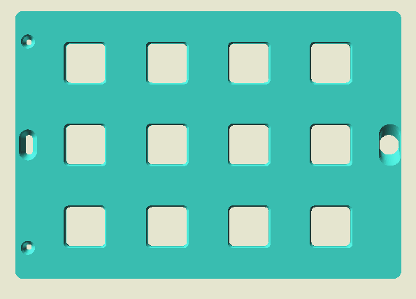
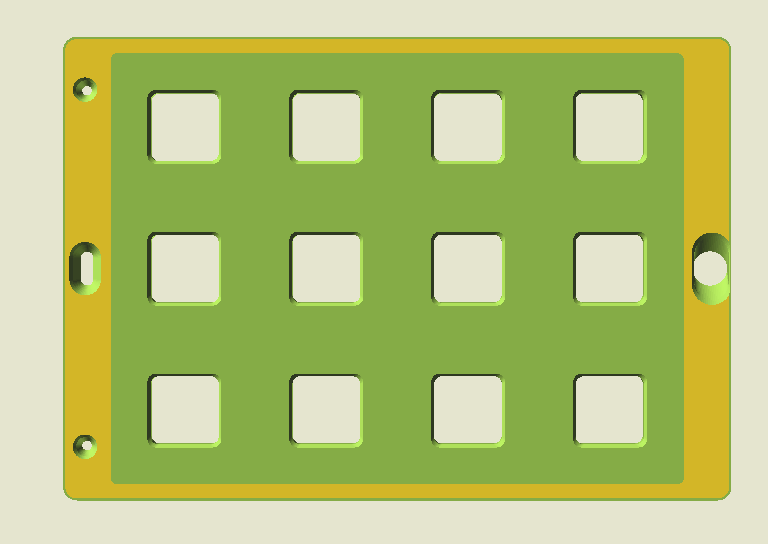
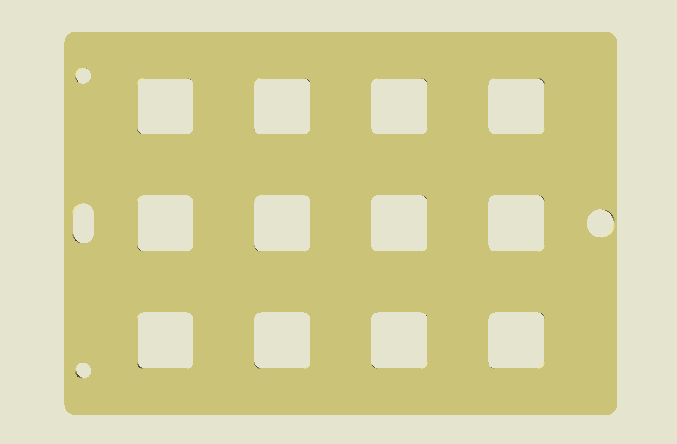
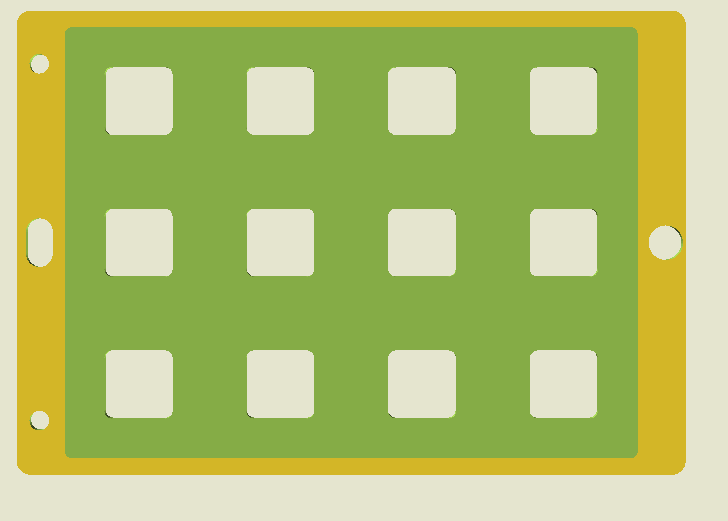
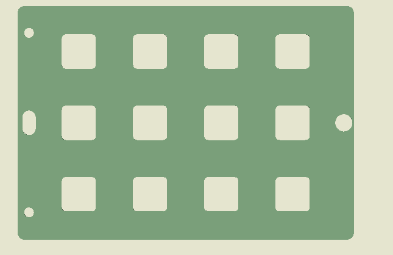
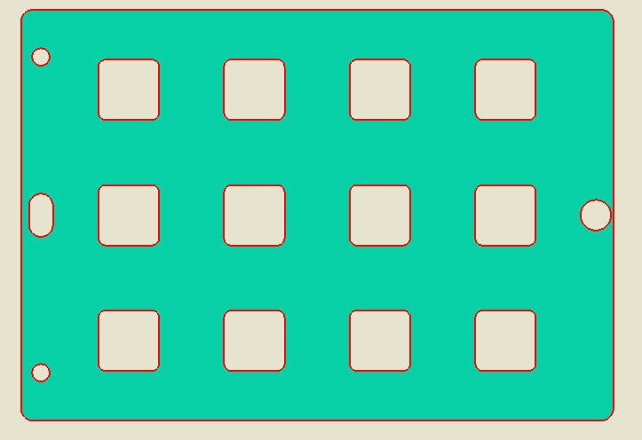

# Desktop Baseline — Keyguard v75 Default Parameters

> **Audit:** OpenSCAD Color/Display Parity Investigation
> **Phase:** Testing Round 7 — Desktop Reference Data
> **Date:** 2026-03-12
> **Fixture:** `tests/fixtures/keyguard-v75/`
> **Versions Tested:** OpenSCAD 2021.01 (CGAL) and 2026.01.03 Nightly (Manifold)

---

## Overview

This document captures the structured desktop reference data for the keyguard
v75 project rendered with **default parameters** across three test scenarios.
Data was collected both manually (screenshots, console logs from the
stakeholder's 2021.01 installation) and programmatically via
`scripts/desktop-audit.ps1`.

All data references use relative paths from `docs/audit/testing-round-7/`.

---

## Scenario 1: 3D-Printed Keyguard

**Scenario ID:** `3d-printed-keyguard`
**Scenario Matrix Ref:** [S-001](../scenario-matrix.md#s-001--3d-printed-keyguard-color-not-preserved-in-browser)

### Parameters

| Parameter | Value |
|-----------|-------|
| `type_of_keyguard` | `"3D-Printed"` |
| `generate` | `"keyguard"` |

### Desktop Screenshots (Manual — 2021.01)

| Mode | Screenshot |
|------|------------|
| F5 Preview |  |
| F6 Render |  |

**Nightly CLI screenshot:** [reference-data/cli-extracts/nightly/screenshots/3d-printed-keyguard.png](reference-data/cli-extracts/nightly/screenshots/3d-printed-keyguard.png)

### Color Analysis

| Property | Value |
|----------|-------|
| SCAD source call | `color("Turquoise")` |
| CSS Turquoise (exact) | `#40E0D0` — `RGB(64, 224, 208)` |
| F5 Preview color (observed) | `#39bdb0` |
| F6 Render colors (observed) | `#D3B627` (yellow/positive), `#85AC46` (green/subtracted) |
| **COFF face palette (Nightly)** | **`#40E0D0` Turquoise — 12016/12016 faces (100%)** |

The F5 Preview color `#39bdb0` differs from exact CSS Turquoise `#40E0D0`
because OpenSCAD 2021.01's preview renderer applies lighting and shading to the
user-assigned color. The COFF export from Nightly outputs the exact CSS color
value, confirming the SCAD source uses `color("Turquoise")`.

The F6 Render colors (`#D3B627` yellow, `#85AC46` green) are CGAL engine-assigned
CSG face colors (System 2 in the [coloring theory](../desktop-coloring-theory.md)):
yellow = positive/original surfaces, green = surfaces created by `difference()`.

### Geometry Statistics

| Metric | 2021.01 (CGAL) | Nightly (Manifold) |
|--------|----------------|---------------------|
| Geometry type | 3D | 3D (manifold) |
| Vertices | 5,658 | 5,978 |
| Facets | 3,247 | 12,016 |
| Render time | 39.1 s | 0.15 s |
| STL size | 1,753 KB | 3,315 KB |
| OFF size | 321 KB | 472 KB (COFF) |

The vertex/facet count difference between CGAL and Manifold is expected:
Manifold uses a different tessellation strategy that produces more triangles
but renders ~260x faster.

### Console Output

No ECHO lines for this scenario (the keyguard generation path does not emit
diagnostic output). Single warning: `Viewall and autocenter disabled in favor
of $vp*`.

### JSON Reference Data

- [cli-extracts/2021.01/3d-printed-keyguard.json](reference-data/cli-extracts/2021.01/3d-printed-keyguard.json)
- [cli-extracts/nightly/3d-printed-keyguard.json](reference-data/cli-extracts/nightly/3d-printed-keyguard.json)

---

## Scenario 2: Laser-Cut Keyguard

**Scenario ID:** `laser-cut-keyguard`
**Scenario Matrix Ref:** [S-002](../scenario-matrix.md#s-002--laser-cut-keyguard-color-not-preserved-in-browser)

### Parameters

| Parameter | Value |
|-----------|-------|
| `type_of_keyguard` | `"Laser-Cut"` |
| `generate` | `"keyguard"` |

### Desktop Screenshots (Manual — 2021.01)

| Mode | Screenshot |
|------|------------|
| F5 Preview |  |
| F6 Render |  |

**Nightly CLI screenshot:** [reference-data/cli-extracts/nightly/screenshots/laser-cut-keyguard.png](reference-data/cli-extracts/nightly/screenshots/laser-cut-keyguard.png)

### Color Analysis

| Property | Value |
|----------|-------|
| SCAD source call | Unknown — requires SCAD source analysis |
| F5 Preview color (observed) | `#CBC377` |
| F6 Render colors (observed) | `#D3B627` (yellow/positive), `#85AC46` (green/subtracted) |
| **COFF face palette (Nightly)** | **`#F0E68C` Khaki — 6636/6636 faces (100%)** |

The COFF data reveals the SCAD source uses `color("Khaki")` (CSS `#F0E68C`)
for the laser-cut variant. The observed F5 Preview color `#CBC377` differs from
exact CSS Khaki due to OpenSCAD's preview lighting/shading — the same behavior
observed for Turquoise in Scenario 1.

The F6 Render colors are identical to Scenario 1 because they are CGAL engine
colors (System 2), independent of user `color()` assignments.

### Geometry Statistics

| Metric | 2021.01 (CGAL) | Nightly (Manifold) |
|--------|----------------|---------------------|
| Geometry type | 3D | 3D (manifold) |
| Vertices | 2,690 | 3,288 |
| Facets | 1,531 | 6,636 |
| Render time | 13.9 s | 0.09 s |
| STL size | 978 KB | 1,868 KB |
| OFF size | 156 KB | 272 KB (COFF) |

The laser-cut keyguard is geometrically simpler than the 3D-printed variant
(fewer vertices, fewer facets) because the laser-cut design has a thinner
profile and fewer 3D features.

### Console Output

Two empty ECHO lines (delimiters). Single warning: `Viewall and autocenter
disabled in favor of $vp*`.

### JSON Reference Data

- [cli-extracts/2021.01/laser-cut-keyguard.json](reference-data/cli-extracts/2021.01/laser-cut-keyguard.json)
- [cli-extracts/nightly/laser-cut-keyguard.json](reference-data/cli-extracts/nightly/laser-cut-keyguard.json)

---

## Scenario 3: Laser-Cut First Layer (SVG/DXF)

**Scenario ID:** `laser-cut-first-layer`
**Scenario Matrix Ref:** [S-003](../scenario-matrix.md#s-003--first-layer-preview-color-not-preserved-in-browser), [S-009](../scenario-matrix.md#s-009--svg-laser-cutting-export-workflow-unclear)

### Parameters

| Parameter | Value |
|-----------|-------|
| `type_of_keyguard` | `"Laser-Cut"` |
| `generate` | `"first layer for SVG/DXF file"` |

### Desktop Screenshots (Manual — 2021.01)

| Mode | Screenshot |
|------|------------|
| F5 Preview |  |
| F6 Render |  |

**Nightly CLI screenshot:** [reference-data/cli-extracts/nightly/screenshots/laser-cut-first-layer.png](reference-data/cli-extracts/nightly/screenshots/laser-cut-first-layer.png)

### Color Analysis

| Property | Value |
|----------|-------|
| SCAD source call | Unknown — requires SCAD source analysis |
| F5 Preview color (observed) | `#7A9F7A` |
| F6 Render colors (observed) | `#07D0A7`, `#FF0603` |
| COFF face palette (Nightly) | N/A — 2D geometry produces no OFF/STL output |

This scenario produces **2D geometry** (via `projection()` in the SCAD source),
so there is no OFF or STL export. The F6 Render colors `#07D0A7` and `#FF0603`
are CGAL engine colors for 2D geometry and are unrelated to the preview color.

### Geometry Statistics

| Metric | 2021.01 (CGAL) | Nightly (Manifold) |
|--------|----------------|---------------------|
| Geometry type | 2D | 2D |
| Vertices | N/A | N/A |
| Facets | N/A | N/A |
| Render time | ~0 s | N/A |
| STL size | N/A (2D) | N/A (2D) |
| OFF size | N/A (2D) | N/A (2D) |

### SVG Export

Both versions successfully export SVG for this 2D scenario:

| Metric | 2021.01 | Nightly |
|--------|---------|---------|
| File size | 20,590 bytes | 20,518 bytes |
| `viewBox` | `-123 -85 246 170` | `-123 -86 246 172` |
| Path count | 1 | 1 |

The slight `viewBox` difference (170 vs 172 height, -85 vs -86 y-offset) between
versions is a minor tessellation difference; the geometry is functionally identical.

### Console Output (ECHO lines)

This is the only scenario that produces diagnostic ECHO output. Both versions
emit the same key information:

```
ECHO: "type of tablet: iPad 9th generation"
ECHO: "use Laser Cutting best practices: yes"
ECHO: "orientation: landscape"
ECHO: "height of opening in case: 170 mm."
ECHO: "have a case? yes"
ECHO: "width of opening in case: 245 mm."
ECHO: "case opening corner radius: 3 mm."
ECHO: "number of columns: 4"
ECHO: "vertical rail width: 26.948 mm."
ECHO: "horizontal rail width: 26.948 mm."
ECHO: "mounting method: No Mount"
ECHO: "number of rows: 3"
```

These values describe the default tablet (iPad 9th generation) in landscape
orientation with a case, producing a 4-column by 3-row grid layout. This
output is essential for verifying that the Forge browser app produces the same
grid configuration.

### JSON Reference Data

- [cli-extracts/2021.01/laser-cut-first-layer.json](reference-data/cli-extracts/2021.01/laser-cut-first-layer.json)
- [cli-extracts/nightly/laser-cut-first-layer.json](reference-data/cli-extracts/nightly/laser-cut-first-layer.json)

---

## Cross-Version Comparison: 2021.01 (CGAL) vs Nightly (Manifold)

### Geometry Differences

| Scenario | CGAL Vertices | Manifold Vertices | CGAL Facets | Manifold Facets |
|----------|--------------|-------------------|-------------|-----------------|
| 3d-printed-keyguard | 5,658 | 5,978 (+5.7%) | 3,247 | 12,016 (+270%) |
| laser-cut-keyguard | 2,690 | 3,288 (+22%) | 1,531 | 6,636 (+333%) |
| laser-cut-first-layer | N/A (2D) | N/A (2D) | N/A | N/A |

Manifold produces significantly more facets because it triangulates all faces
(every face is a triangle), while CGAL preserves larger polygonal faces. The
mesh is geometrically equivalent — the higher facet count does not indicate
additional geometric detail.

### Performance

| Scenario | CGAL Render | Manifold Render | Speedup |
|----------|-------------|-----------------|---------|
| 3d-printed-keyguard | 39.1 s | 0.15 s | **261x** |
| laser-cut-keyguard | 13.9 s | 0.09 s | **154x** |
| laser-cut-first-layer | ~0 s | ~0 s | N/A |

Manifold is 150-260x faster than CGAL on these real-world scenarios. This
matches the Forge browser app's experience — the WASM build uses the Manifold
backend.

### Color Data Availability

| Feature | 2021.01 (CGAL) | Nightly (Manifold) |
|---------|----------------|---------------------|
| OFF export | Plain OFF (no color) | COFF with per-face RGB |
| `--enable=render-colors` | Not supported | Supported |
| User `color()` in export | Not available | Available in COFF |
| Engine CSG colors in export | Not available | Not observed (all faces = user color) |

The Nightly's COFF output includes per-face RGB values that match the SCAD
`color()` calls exactly. This confirms the `render-colors` feature (merged in
PR #5185, July 2024) is active in this Nightly build.

---

## Key Findings for Forge Parity

1. **COFF carries exact user colors.** The Nightly's COFF export for
   `3d-printed-keyguard` contains `RGB(64, 224, 208)` = Turquoise on all 12,016
   faces, and `laser-cut-keyguard` contains `RGB(240, 230, 140)` = Khaki on all
   6,636 faces. If the Forge WASM build produces the same COFF output, the
   browser can extract and display per-face colors directly.

2. **Single-color meshes.** Each 3D scenario uses one `color()` call for the
   entire geometry — there is no multi-color mixing within a single scenario.
   This simplifies the browser rendering requirement: each mesh needs exactly
   one material color, derived from the COFF palette.

3. **2D geometry produces no color data.** The laser-cut first layer scenario
   (2D, `projection()`) cannot export to OFF/STL. Color handling for this
   scenario must come from a different mechanism (e.g., parsing `color()` calls
   from the SCAD source, or a convention-based default).

4. **ECHO output is scenario-specific.** Only the `laser-cut-first-layer`
   scenario emits detailed ECHO lines with tablet dimensions and grid
   configuration. The 3D scenarios produce no ECHO output.

---

## Reference Data Index

### Manual Captures (2021.01)

| File | Path |
|------|------|
| F5 Preview: 3D-Printed | `reference-data/manual-captures/screenshots/preview-3d-printed.png` |
| F5 Preview: Laser-Cut | `reference-data/manual-captures/screenshots/preview-laser-cut.png` |
| F5 Preview: First Layer | `reference-data/manual-captures/screenshots/preview-laser-cut-first-layer.png` |
| F6 Render: 3D-Printed | `reference-data/manual-captures/screenshots/rendered-3d-printed.png` |
| F6 Render: Laser-Cut | `reference-data/manual-captures/screenshots/rendered-laser-cut.png` |
| F6 Render: First Layer | `reference-data/manual-captures/screenshots/rendered-laser-cut-first-layer.png` |
| Console log | `reference-data/manual-captures/console-log-2021.01.txt` |
| Color codes | `reference-data/manual-captures/color-codes.json` |

### CLI Extracts

| File | Path |
|------|------|
| 2021.01: 3D-Printed | `reference-data/cli-extracts/2021.01/3d-printed-keyguard.json` |
| 2021.01: Laser-Cut | `reference-data/cli-extracts/2021.01/laser-cut-keyguard.json` |
| 2021.01: First Layer | `reference-data/cli-extracts/2021.01/laser-cut-first-layer.json` |
| Nightly: 3D-Printed | `reference-data/cli-extracts/nightly/3d-printed-keyguard.json` |
| Nightly: Laser-Cut | `reference-data/cli-extracts/nightly/laser-cut-keyguard.json` |
| Nightly: First Layer | `reference-data/cli-extracts/nightly/laser-cut-first-layer.json` |
| Nightly Screenshot: 3D-Printed | `reference-data/cli-extracts/nightly/screenshots/3d-printed-keyguard.png` |
| Nightly Screenshot: Laser-Cut | `reference-data/cli-extracts/nightly/screenshots/laser-cut-keyguard.png` |
| Nightly Screenshot: First Layer | `reference-data/cli-extracts/nightly/screenshots/laser-cut-first-layer.png` |
