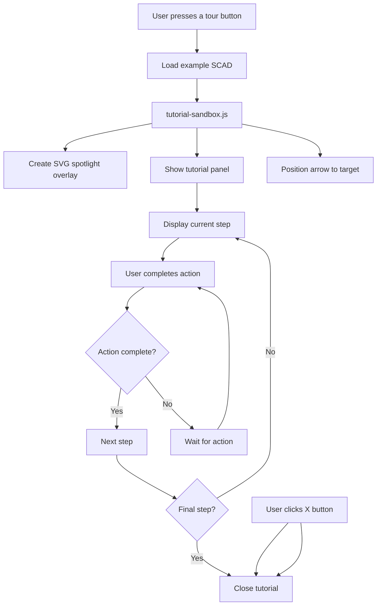

# Welcome Screen

The welcome screen is what you land on with no project open. It offers a few
things to start with, and a collapsed section explaining who the app is built
for.

*Verified against `index.html` on 2026-08-26.*

## What is on it

### Cards you see straight away

Five, in this order:

| Card | Its button does |
|---|---|
| **Welcome Page Tour** | Starts a guided tour of the welcome page itself. Loads no model. |
| **Beginners Start Here** | Loads the `simple-box` example and starts the introductory tour. Also has an "Open Help" link to the Workflow page. |
| **Charm Customizer** | Opens the `q-charm` example -- design a charm, pendant or zipper pull. |
| **Braille Card Customizer** | Opens the `braille-sign` example -- type text, get printable braille. |
| **Stencil Maker** | Opens the `stencil-maker` example -- turn a picture into a spray-paint stencil for 3D printing or laser cutting. |

Only the first two start a tutorial. The others open a ready-made tool.

### "Explore Features & Accessibility"

Below those sits a disclosure with that heading, **collapsed by default**.
Opening it reveals six more cards:

- Explore Features
- Advanced Makers
- Keyboard-Only Users
- Low Vision Users
- Voice Input Users
- Screen Reader Users

These are **not** tutorials and they load no model. Each describes who it is for,
lists what the app offers that group, and has a single button that opens the
relevant page of the in-app Help guide. They exist so that someone who needs
high contrast, or uses only a keyboard, can find out what is there without
reading a manual.

## Why it is shaped this way

Showing four things and hiding six keeps the first screen short, which matters
most for the people the app is built for: a long screen is a long way to travel
with a screen reader or a switch. The six that are hidden are reference
material rather than something to do, so they are one keystroke away rather than
in the way.

## Implementation

### Tutorial Sandbox System

Module: `src/js/tutorial-sandbox.js`

All role paths launch a spotlight coachmark tutorial after loading the example.

This applies to the two cards that start a tour -- Welcome Page Tour and
Beginners Start Here. The Welcome Page Tour skips the loading step, because it
tours the page you are already on.

Features include:

- Step-by-step walkthroughs (4-6 steps per path)
- Floating panel with smart positioning
- SVG spotlight with cutout around target (click-through enabled)
- Arrow pointer from panel to target element
- Keyboard navigation (Arrow keys, Escape, Tab)
- ARIA-friendly with live announcements
- Step gating for "Try this" actions
- Reduced motion and forced-colors support
- Mobile-responsive (panel docks to bottom on small screens)
- Focus restoration on close

### Tutorial Content Structure

Each tutorial follows this pattern:
- **Step 1:** Welcome/overview (what you'll learn, exit hint)
- **Steps 2-N:** Feature spotlights with action prompts
- **Final step:** Completion summary and next steps

Guidelines:
- Keep text short and scannable
- Use `<strong>` for element names
- Use `<kbd>` for keyboard shortcuts
- Completion actions should be simple (one click, one change)

The introductory tour uses the `simple-box` example. The welcome-page tour uses
no example at all.

The app remembers which tours you have finished or dismissed, so a tour you have
already seen does not offer itself again.

## Related Documentation

- [Accessibility Guide](ACCESSIBILITY_GUIDE.md) - Full accessibility features reference
- [Keyguard Workflow Guide](KEYGUARD_WORKFLOW_GUIDE.md) - Keyboard-first workflow
- [Testing](../TESTING.md) - Test commands
