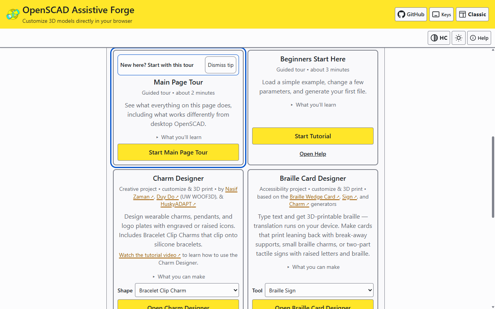
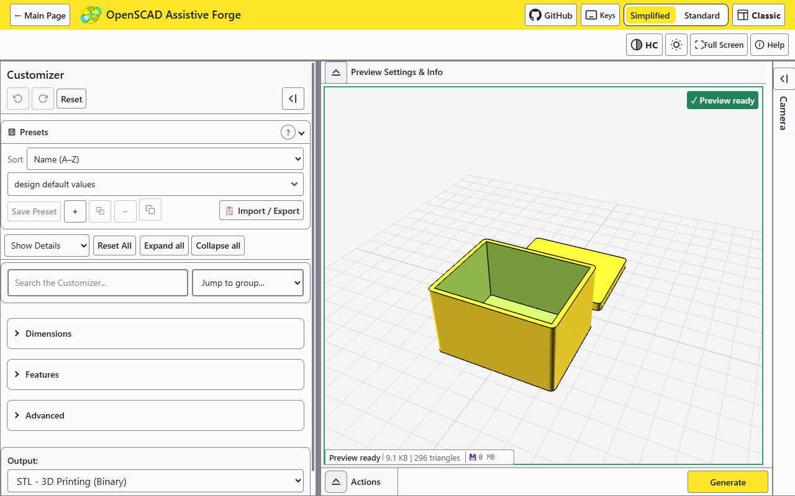
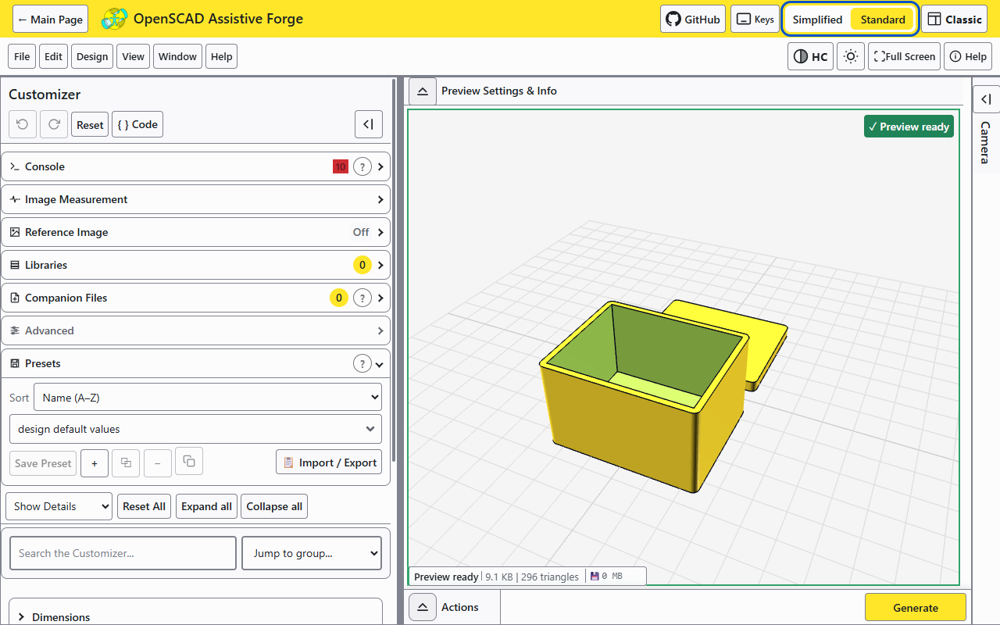
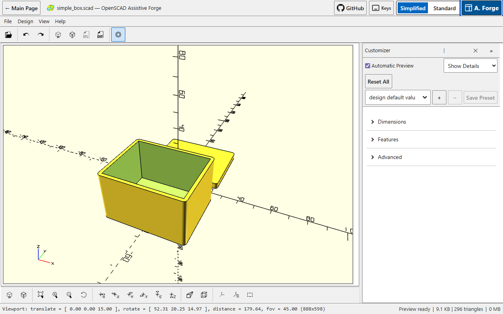
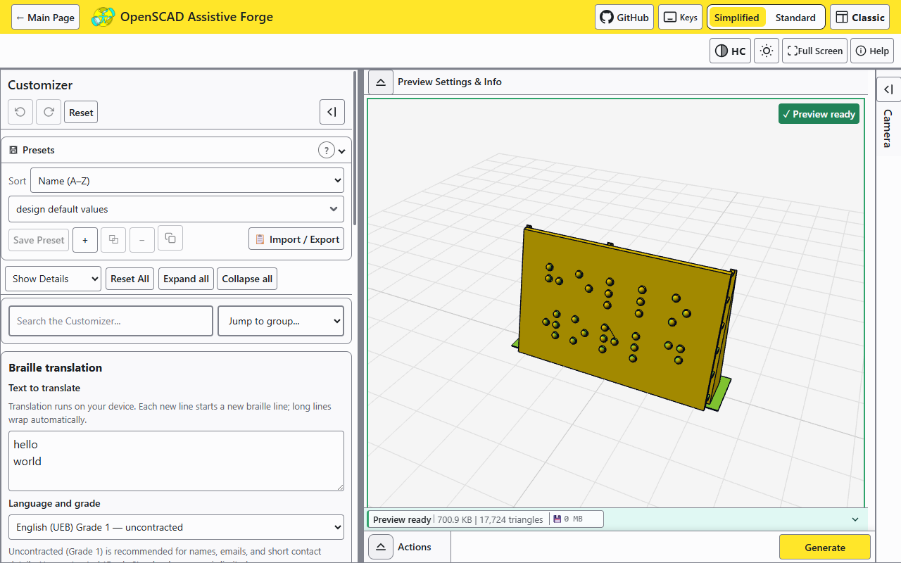
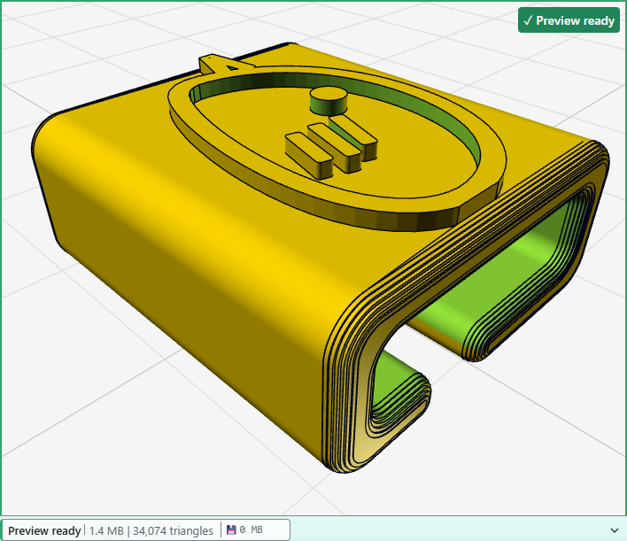
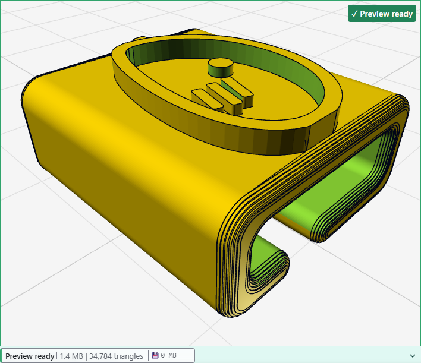
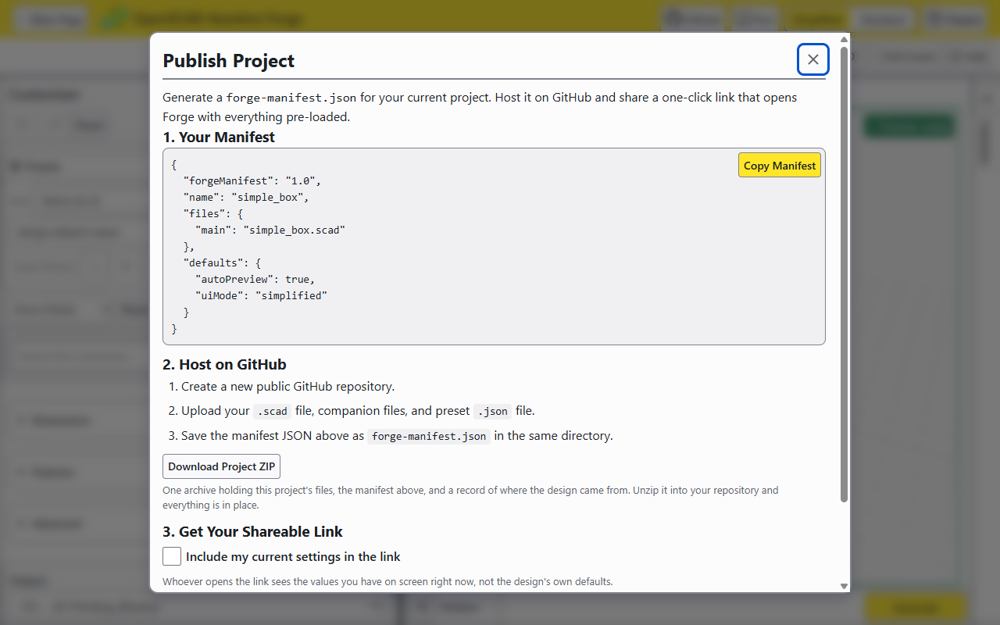

<!--
  DRAFT - this journal and every image alt text in it are awaiting my
  review pass before release. Do not link from released surfaces until
  this banner is removed.
-->

# What's new in version 5

What changed since version 4.5.0 shipped in July 2026, with pictures of the
app as it is today. The complete record is [CHANGELOG.md](../../CHANGELOG.md).

## The welcome screen

A guided tour and a beginners' path sit at the top. Below them, each tool
has its own card with a short description and the credits for the designers
whose work it builds on. On a phone, the dialog fits the screen.

The Charm Customizer and the Braille Card Customizer are now the **Charm
Designer** and the **Braille Card Designer**. Three things on one screen were
called Customizers; now only the parameter panel is.

## Three interfaces

Simplified and Standard are two views of the Assistive Forge interface, and
Classic is the desktop layout. You can switch at any time without losing
work.

**Simplified** is the default: the parameters on the left, the model on the
right, one Generate button.

**Standard** adds the console, libraries, companion files, reference images
and image measurement.

**Classic** reproduces the desktop OpenSCAD layout: the menu bar, the icon
toolbar, the pale viewport with its axes, and the readout along the bottom.
The camera controls are the desktop ones.

## Braille

Translation runs on your device. The text never leaves your browser.

New in version 5 is the braille editor: a Unicode braille field on the Card
and the Sign, where you can check and correct the translation cell by cell
before printing. Cards size themselves to their content by default, one print
can carry several charms, and downloads are named after their content, such
as `braille-card-hello-world.stl`.

## A charm from a drawing

![The Charm Designer's design file control with a bird drawing chosen: the six gallery designs above it, a Choose File button with a small bird thumbnail beside it, the file line "bird-drawing.png (60.9 KB). Ready to convert.", the sentence "Looks like a line drawing. Converting should take a few seconds.", a Start conversion button, and under the heading "What to keep from the picture" four choices, Line art (chosen), Solid shape, Light and dark and Colors, each with a sentence on when to use it. To the right, the charm preview reads Preview ready](images/charm-customizer.png)

The Charm Designer turns a drawing into a pendant. The drawing editor under
it also opens a drawing, cleans it up, and saves it back as SVG or DXF, with
no 3D design involved. Symbols keep their pictures. If another program is
watching a folder, your edits can be saved straight into it.

Choosing a photo or a PNG no longer takes the page away. Forge looks at the
picture first and says in one sentence what it appears to be and roughly what
it will cost. A small, simple picture converts by itself. Anything bigger
waits for **Start conversion**. While a conversion runs there is a progress
bar and a **Cancel** that stops it. Four choices decide what to keep from the
picture, each with a sentence about when to use it.

Conversions are faster. Tracing runs on a worker thread, so the page keeps
responding, and one step that took nineteen seconds now takes about one and
a half.

![The drawing editor over the charm preview: a bird line drawing in deep blue, the color of layer 1, fills the left side under the heading "Will print as", with Fit, plus and minus buttons, four arrow buttons that move the view, and a color key reading Layer 1, Layer 2, Layer 3, Cut out and Off beneath it. The toolbar holds a Drawing / Charm switch with Drawing chosen, then Crop, Apply, Save SVG, Keep original, Reset and More. On the right, a Shapes panel lists the shapes: each row has the shape's name, an On / Cut out / Off switch with one choice highlighted and a More button, and four of the rows carry a small mark reading thin beside the name](images/drawing-editor.png)

The editor shows one picture. The drawing fills the space, and switching a
shape on or off shows in it. The side-by-side comparison is one button away.
A DXF's curves arrive whole, and the engine's warnings about a file appear in
the editor's warnings list.

Each shape has one row: its name, a switch reading **On · Cut out · Off**,
and a **More** button. On a narrow screen the row says when it has run out
of room instead of cutting the name short. The panel, the row and the screen
reader use the same words. A **Drawing / Charm** switch in the toolbar shows
the charm the drawing will become. While you edit, previews are drawn at
draft quality and return to full quality when you close.

On a phone or a tablet, two fingers zoom and pan the drawing and one finger
scrolls the page. Hovering or pressing a shape marks its row in the list.
Combining a complicated drawing runs off the main thread, a third of a second
after your last change, with one sentence under the picture saying how long
it takes. In the Charm view, **Render preview** draws a draft of the charm
without applying anything.

The last weeks before this release went into the picture-to-charm job,
walked with my own logo. A photo's colored background arrives as one shape
called the wall, and the editor leaves it out, so the charm carries the
drawing rather than a plate with the drawing cut out of it. Every shape
starts on layer 1, and three layers are always offered, each with its own
height on the charm. Several rows can be chosen together with Ctrl+A, Shift
and the arrow keys, and a switch pressed on a chosen row sets them all. The
picture and the list point at each other. A conversion runs in a dialog with
its stages named and a Cancel at each. The editor measures every shape
against half a millimeter at the width the charm will print, says how many
are too thin, and can turn them all off in one press, reversibly. **Crop**:
four sliders take an edge off the picture, a photo is traced again from the
kept part, and Undo crop puts it back. Every word in the app is American
English, and every slider row meets the 44 px touch floor.

### Two heights from one drawing

Every shape starts on layer 1, so a line drawing comes out at one height.

To raise the outline above the rest, open the drawing editor, press **More**
on the outline's row, choose **Layer 2**, and press **Apply**. Layer 2 stands
on layer 1.

Each layer has its own height and can be raised or engraved, in the
**Layered design** group under the design.

## Share it with one link

The Publish dialog writes a small manifest describing your project, bundles
the whole project as one ZIP if you want it, and composes a link that opens
Forge with everything loaded, your settings included if you tick the box.
Every downloaded project carries a provenance record that says where the
design came from. For people wiring Forge into other tools, one contract page
says what to build against.

## Smaller changes

- The drawing editor reads correctly to a screen reader, and the Publish
  dialog is readable in the light theme.
- In high contrast mode the focus ring is thicker, and the toolbar stays on
  the screen.
- The guided tour's cards can be reached and heard while the Customizer is
  open, and a dialog opened during a tour can be answered.
- The preview status line is readable on a phone, and the phone toolbar
  keeps its rows in order.
- When a shared link's numbers have been altered, the warning stays until
  you dismiss it.
- Three high severity security advisories in build dependencies were
  patched, and the supply chain facts are written in one page for anyone
  approving this app for a network.

Thank you for printing, testing, and telling me what broke.
