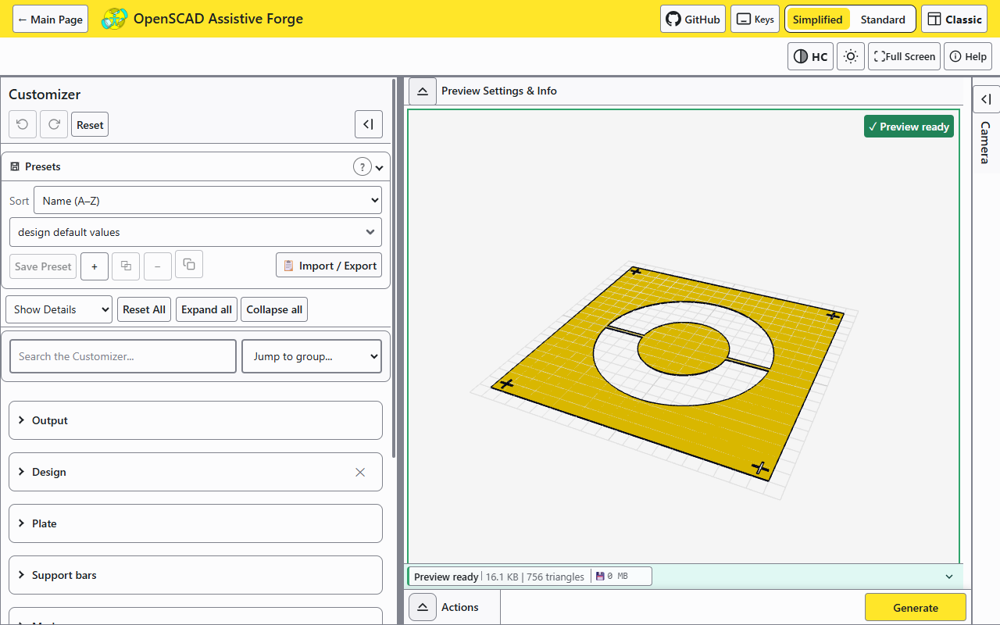

<!--
  DRAFT - this journal and every image alt text in it are awaiting my
  review pass before release. Do not link from released surfaces until
  this banner is removed.
-->

# What's new in version 5

A photo journal of what changed since version 4.5.0 shipped in July
2026. This is the tour I would give you at my desk: the pictures are
the app as it is today, and the words are why each thing exists.

If you want the complete engineering record instead, it lives in
[CHANGELOG.md](../../CHANGELOG.md).

## A friendlier front door

The welcome screen is now a real front door instead of a hurdle. A
guided tour and a beginners' path sit at the top, and below them each
tool gets its own card with a plain description and the credits for
the designers whose work it builds on. On a phone, the dialog finally
fits the screen: the title stays out from under the browser toolbar
and the buttons never wander off the bottom edge.

If you are looking for the Charm Customizer or the Braille Card
Customizer: they are here, renamed the **Charm Designer** and the
**Braille Card Designer**. Two cards and the parameter panel were all
called Customizers, one word doing three jobs on one screen - now the
panel keeps the name and the cards say what they are.

## Three views of the same workshop

Version 5's biggest visible change is that the app now has three
interfaces, and you can switch between them at any time without
losing your work.

**Simplified** is the default and the one in the picture above: the
parameters on the left, the model on the right, one yellow Generate
button. It is built for the person who opened a link and wants a
printable file, not a CAD lesson.

**Standard** adds the working panels back: a console, libraries,
companion files, reference images and image measurement. It is the
middle ground for someone comfortable poking at a project's insides.

**Classic** rebuilds the desktop OpenSCAD experience in the browser:
the menu bar, the icon toolbar, the pale viewport with its axes, the
viewport readout along the bottom. If you learned OpenSCAD on the
desktop, your hands already know where everything is; the camera
controls are the ones you already know. It took a long program of
small fidelity fixes to make this view feel honest rather than like a
costume, and it is the part of version 5 I am quietly proudest of.

## Type words, print braille

The braille tools arrived in 4.5.0; version 5 is where they grew up.
Translation still runs entirely on your device - the text never
leaves your browser. What is new is the braille editor: a Unicode
braille field on both the Card and the Sign where you can inspect and
correct the translation cell by cell before it becomes plastic. Cards
now size themselves to their content by default, the charm can carry
several charms in one print, and downloads leave with names that say
what they are, so `braille-card-hello-world.stl` lands in your
folder instead of a mystery string.

## A charm from a drawing

![The Charm Designer's design file control with a bird drawing chosen: the six gallery designs above it, a Choose File button with a small bird thumbnail beside it, the file line "bird-drawing.png (60.9 KB). Ready to convert.", the sentence "Looks like a line drawing. Converting should take a few seconds.", a Start conversion button, and under the heading "What to keep from the picture" four choices, Line art (chosen), Solid shape, Light and dark and Colors, each with a sentence on when to use it. To the right, the charm preview reads Preview ready](images/charm-customizer.png)

The Charm Designer turns a simple drawing into a wearable pendant,
and feeding it your own art is now a documented job rather than a
favour. The drawing editor underneath it learned the two halves of a
round trip this summer: open a drawing, clean it up, and save it back
out - as SVG or as DXF - even if you never make a 3D design from it.
Symbols keep their pictures instead of turning into colored blobs,
and if another program is watching a folder, your edits can land
straight in it.

Handing it a photograph or a PNG used to be a gamble. You chose a
file and the page went away for as long as it took, with nothing to
look at and no way back. Now, before anything heavy starts, Forge
takes a quick look at the picture and tells you in one sentence what
it seems to be and roughly what it will cost - and then waits. A
picture small and simple enough to be quick gets on with it by
itself; anything bigger waits for **Start conversion**, and while it
runs there is a moving bar and a **Cancel** that actually stops the
work. Underneath,
four plain choices decide what to keep from the picture, each with a
sentence about when to reach for it rather than a name you have to
already know.

Conversions are also a great deal faster. The tracing now runs on a
worker thread, so the page keeps answering while it works, and one
particular step that used to dominate everything was replaced: a
drawing that took nineteen seconds to come back now takes about one
and a half.

![The drawing editor over the charm preview: a bird line drawing in deep blue, the color of layer 1, fills the left side under the heading "Will print as", with Fit, plus and minus buttons, four arrow buttons that move the view, and a color key reading Layer 1, Layer 2, Cut out and Off beneath it. The toolbar holds a Drawing / Charm switch with Drawing chosen, then Crop, Apply, Save SVG, Keep original, Reset and More. On the right, a Shapes panel lists the shapes: each row has the shape's name, an On / Cut out / Off switch with one choice highlighted and a More button, and four of the rows carry a small mark reading thin beside the name](images/drawing-editor.png)

The editor itself got the change I care most about: it is **one
picture** now. The drawing you are editing fills the space, and
switching a shape on or off shows right there in it - the old
side-by-side comparison is still one button away, but it no longer
takes half the room by default. A DXF's curves arrive whole now too
(a sketch that used to open as two shapes opens with all of them),
and anything the engine has to say about a file shows up in the
editor's own warnings list instead of disappearing.

The panel beside the drawing was rebuilt around a single row. Each
shape gets its name, one switch reading **On · Cut out · Off**,
and a **More** button for the rest - and the row can say when it has
run out of room instead of quietly eating the name, which is what it
used to do on a narrow screen. The words changed too: what the panel
calls a thing, what the row calls it, and what a screen reader says
about it are now the same words. A **Drawing / Charm** switch in the
toolbar turns the picture into the charm it will become without
leaving the editor, and while you are editing, previews are drawn at
draft quality so they arrive quickly and go back to full quality when
you close.

On a phone or a tablet the drawing takes two fingers to zoom and pan,
one finger still scrolls the page, and hovering or pressing a shape
marks its row in the list. Combining a complicated drawing no longer
freezes the page either: that work moved off the main thread, and the
result now combines by itself a third of a second after your last
change, with one sentence under the picture saying how long. In the
Charm view a **Render preview** button draws the charm with the
drawing as it stands, as a draft, without applying anything.

The last weeks before this release were spent on the picture-to-charm
job with my own logo in hand, and most of what I found was fixed by
listening rather than by adding. A photograph's colored background
arrives as one big shape now called the wall, and the editor leaves it
out by itself so the charm carries the drawing rather than a plate
with the drawing cut out of it. Every shape starts on layer 1, instead
of the editor guessing a stack from how the shapes nest. Choosing
several rows at once works with the keys you would expect, Ctrl+A and
Delete among them, and the picture and the list point at each other.
A conversion stands in front of the page as a dialog with its stages
named and a Cancel that works at any of them. The editor knows how wide
the charm will really print the drawing, measures every shape against
half a millimeter at that width, says how many are too thin, and can
turn them all off in one press, reversibly. And **Crop**: four
sliders take an edge off the picture, a photo is traced again from the
kept part, and Undo crop puts it back. Underneath all of it, every word
the app says is now American English, and every slider row in the
customizer meets the 44 px touch floor.

## A stencil from a picture

The Stencil Maker is new since 4.5.0. It takes a shape or a picture
and produces printable stencil plates: bridges hold the islands so
the letter centers do not fall out, registration marks in the corners
line the plates up, and a multi-colour picture becomes one plate per
paint color with a jig to keep them all honest.

## Share it with one link

Sharing used to mean sending someone a file and a paragraph of
instructions. Now the app writes the instructions itself. The Publish
dialog generates a small manifest describing your project, hands you
the whole thing as one ZIP if you prefer, and composes a link that
opens Forge with everything pre-loaded - your settings included, if
you tick the box. Every downloaded project also carries a provenance
record now, a small file that says where the design came from, so a
file that travels can still answer for itself. For the people wiring
Forge into pipelines and other tools, there is finally one contract
page to build against without talking to anybody.

## The quieter work

Most of a year's effort does not photograph well, and that is fine.
A sample of what else changed, in plain terms:

- The drawing editor reads correctly to a screen reader, and the
  Publish dialog is readable in the light theme again.
- High contrast mode got the thicker focus ring it always asked for,
  and it no longer pushes the toolbar off the side of the screen.
- The guided tour's cards can be reached and heard while the
  Customizer is open, and a dialog opened during a tour is a dialog
  you can actually answer.
- The preview status line can be read on a phone, and the phone
  toolbar earns its rows instead of wrapping into chaos.
- When a shared link's numbers have been altered, the warning waits
  for you to read it instead of vanishing on a timer.
- Three high severity security advisories in build dependencies were
  patched, and the supply chain facts are now written down in one
  place for anyone who needs to approve this app for a network.

Thank you for printing, testing, and telling me what broke. Version 5
is the release where the workshop got big enough for everyone I built
it for.
